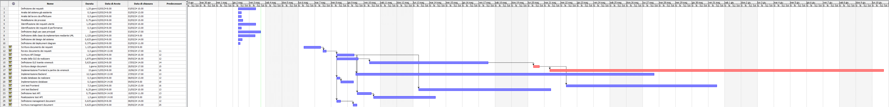

# Project Estimation - FUTURE
Date: 04/05/2024

Version: Version: 1.0.1 - Fixed Summary

# Estimation approach
Consider the EZElectronics  project in FUTURE version (as proposed by your team in requirements V2), assume that you are going to develop the project INDEPENDENT of the deadlines of the course, and from scratch (not from V1)
# Estimate by size
### 
|                                                                                                         | Estimate |
| ------------------------------------------------------------------------------------------------------- | -------- |
| NC =  Estimated number of classes to be developed                                                       | 12       |
| A = Estimated average size per class, in LOC                                                            | 300      |
| S = Estimated size of project, in LOC (= NC * A)                                                        | 3600     |
| E = Estimated effort, in person hours (here use productivity 10 LOC per person hour)                    | 360      |
| C = Estimated cost, in euro (here use 1 person hour cost = 30 euro)                                     | 10800    |
| Estimated calendar time, in calendar weeks (Assume team of 4 people, 8 hours per day, 5 days per week ) | 3        |
# Estimate by product decomposition
### 
| component name       | Estimated effort (person hours) |
| -------------------- | ------------------------------- |
| requirement document | 94                              |
| GUI prototype        | 60                              |
| design document      | 8                               |
| code                 | 228                             |
| unit tests           | 110                             |
| api tests            | 18                              |
| management documents | 10                              |

# Estimate by activity decomposition
### 

| Activity name                                         | Estimated effort (person hours) |
| ----------------------------------------------------- | ------------------------------- |
| Definizione dei requisiti                             | 10                              |
| Analisi del sistema già esistente                     | 4                               |
| Analisi del lavoro da effettuare                      | 4                               |
| Modellazione dei processi                             | 6                               |
| Identificazione dei requisiti utente                  | 10                              |
| Identificazione dei requisiti di performance          | 4                               |
| Definizione degli use case principali                 | 16                              |
| Definizione delle classi da implementare mediante UML | 9                               |
| Definizione del design del sistema                    | 5                               |
| Definizione del deployment diagram                    | 3                               |
| Scrittura documento dei requisiti                     | 9                               |
| Review documento dei requisiti                        | 4                               |
| API design                                            | 10                              |
| Analisi della GUI da realizzare                       | 15                              |
| Definizione GUI tramite wiremock                      | 45                              |
| Scrittura design document                             | 8                               |
| Implementazione Frontend a partire da wiremock        | 120                             |
| Implementazione Backend                               | 100                             |
| Analisi database da realizzare                        | 4                               |
| Implementazione database                              | 4                               |
| Unit test Frontend                                    | 60                              |
| Unit test Backend                                     | 50                              |
| Definizione test API                                  | 6                               |
| Realizzazione test API                                | 12                              |
| Definizione management document                       | 5                               |
| Scrittura management document                         | 5                               |

###

# Summary

Report here the results of the three estimation approaches. The estimates may differ. Discuss here the possible reasons for the difference

|                                    | Estimated effort | Estimated duration |
| ---------------------------------- | ---------------- | ------------------ |
| estimate by size                   |       360        |    ~2.25 weeks     |
| estimate by product decomposition  |       518        |     ~3.5 weeks     |
| estimate by activity decomposition |       518        |     ~3.5 weeks     |
  
Le stime di effort e durata sono diverse siccome ci sono 4 impiegati che lavorano 8 ore al giorno e 5 giorni a settimana. Quindi, in una settimana si hanno 160 person hours, perciò, ci vogliono diversi giorni di calendario per completare il progetto
  
La stima per size è molto minore rispetto alle altre due siccome nella prima si stima il lavoro soltanto rispetto alle linee di codice (LOC) e non viene contata l'analisi dei requisiti

