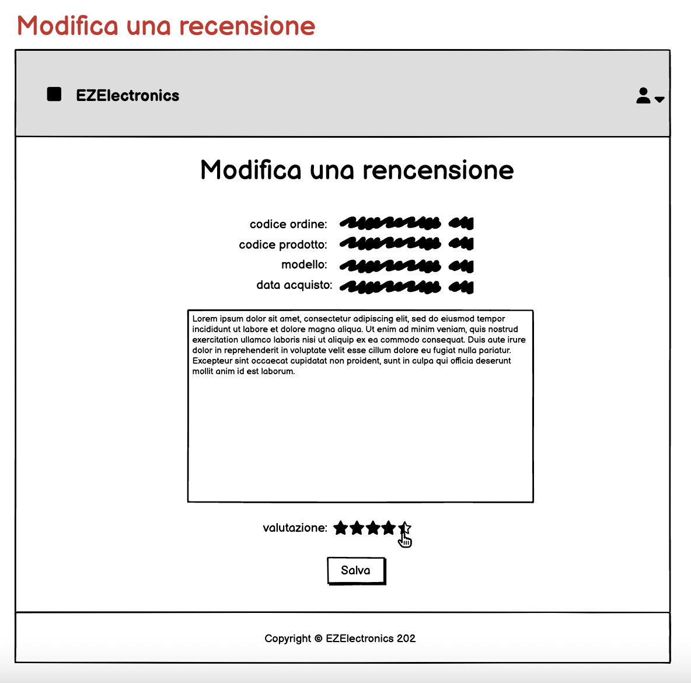
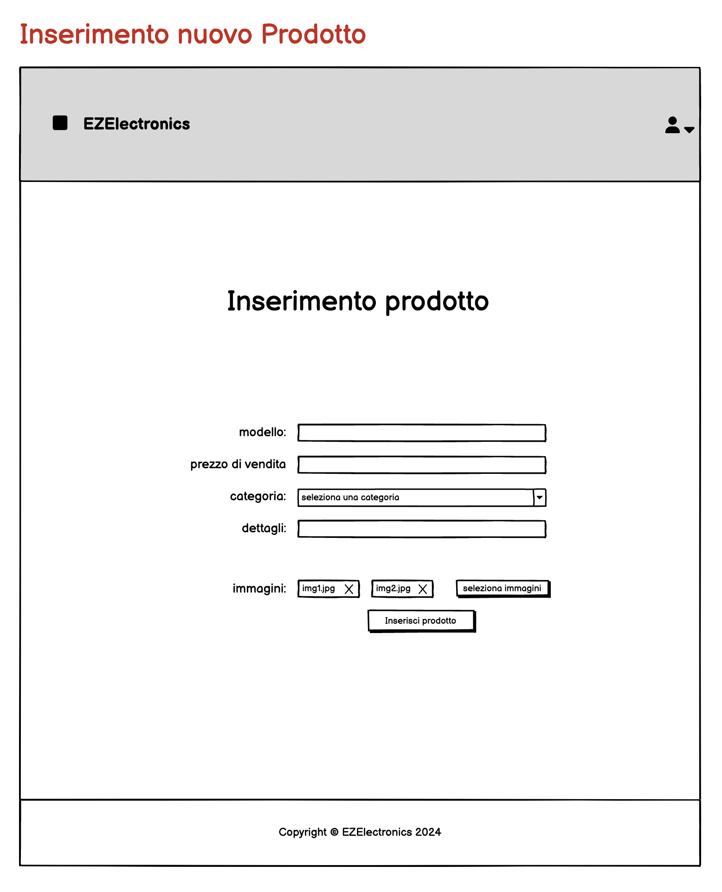

# Graphical User Interface Prototype - FUTURE

Authors: Group 02 - Anita Ascheri, Giorgio Bongiovanni, Paolo Cagliero, Roberto Candela

Date: 03/05/2024

Version: 1.0.0

## Home Page (User)
Home page di un account di tipo User. L'utente può vedere l'elenco di prodotti disponibili. Schiacciando sopra ad un prodotto, si apre una nuova pagina con i dettagli di tale prodotto.

  

## Selezione Categoria
All'interno della home page, l'utente può cercare un prodotto per modello oppure filtrare l'elenco di prodotti per categoria.

## Opzioni utente
Aprendo il menù a tendina accanto al simbolo dell'utente, si può scegliere se visualizzare il profilo o effettuare il logout.

## Utente non loggato
Nel caso in cui l'utente non sia loggato, il menù a tendina mostra un'opzione per effettuare il login e una per registrarsi.

## Home Page (Manager)
Home Page di un account di tipo Manager. Il manager può visualizzare l'elenco dei prodotti da lui caricati, cancellarli o contrassegnarli come venduti.

## Home Page (Technical User)
Home Page di un account di tipo Technical User.
Il Technical User ha gli stessi privilegi di un account di tipo Manager, tranne per l'aggiunta prodotti.
Può creare una categoria nuova ed aggiungere o rimuovere un corriere

## Login 

## Registrazione (Customer)
Pagina di registrazione riferita ad un utente Customer.
I campi obbligatori sono contrassegnati dall'asterisco.

## Conferma mail (Customer)
Se tutti i campi obbligatori sono stati valorizzati correttamente, il sistema chiede di verificare l'indirizzo email appena inserito dal Customer, mediante un codice di verifica.

## Password dimenticata (Customer)
Se l'indirizzo email inserito fa riferimento ad un profilo Customer realmente esistente, viene inviato un codice all'indirizzo inserito per effettuare il reset della password.

## Modifica password (Customer)
Se l'utente Customer inserisce correttamente il codice di verifica, ha accesso a questa pagina in cui viene chiesto di inserire una nuova password.

## User profile (Customer)
Informazioni relative ad un profilo Customer. Da questa schermata l'utente ha accesso allo storico dei suoi ordini.
Può inoltre inserire, modificare o cancellare una recensione relativa ad un prodotto da lui acquistato. 

## Creazione recensione (Customer)

Da questa schermata l'utente può creare una recensione per un prodotto da lui acquistato. 
Ha a disposizione un testo e una scala di valutazione da 1 a 5 stelle. Scorrendo sulle stelle con il mouse e poi cliccando può esprimere la propria preferenza.

## Modifica recensione (Customer)

Da questa schermata l'utente può modificare una recensione per un prodotto da lui acquistato.

## Manager profile
Informazioni relative ad un profilo Manager. Da questa schermata l'utente Manager ha accesso ai prodotti vendibili e ai relativi dettagli.

## Edit profile
Da questa pagina l'utente può modificare le informazioni a lui relative.

## Technical User Profile
Da questa schermata l'utente di tipo Technical User può aggiungere un nuovo utente di tipo Manager e visualizzare la lista di tutti gli utenti ed eventualmente rimuoverli, cliccando sull'icona del cestino.

## Creazione account manager

Una volta che un nuovo manager è stato assunto, un utente di tipo Technical User si occupa del censimento di questo utente nel sistema.
Da questa schermata può valorizzare tutte le informazioni necessarie alla registrazione.

## Modifica prodotto a catalogo

Questa schermata è visualizzabile solo da un Manager o da un Technical User.
Da qui si possono modificare le informazioni di un prodotto a catalogo, inteso come "concetto" di prodotto.

## Inserimento prodotto a catalogo

Questa schermata è visualizzabile solo da un Manager.
Da qui è possibile inserire un nuovo prodotto a catalogo, inteso come "concetto" di prodotto.

## Arrivo di un prodotto
Viene registrato l'arrivo di un set di prodotti dello stesso modello

## Pagina Prodotto
In questa pagina vengono visualizzate le informazioni relative ad un prodotto, tra cui il numero di recensioni inserite e la valutazione media. Al di sotto del Modello del prodotto, è visualizzato il nome del negozio che lo vende. 
Cliccando sul link delle recensioni del prodotto, il sistema rimanda all'elenco delle recensioni inserite.
Inoltre, è possibile aggiungere il prodotto al carrello.

## Elenco recensioni per prodotto

Da questa schermata l'utente può visualizzare tutte le recensioni e le relative valutazioni inserite per quel prodotto.

## Prodotto aggiunto al carrello
Una volta che il prodotto è stato aggiunto al carrello, viene mostrato un pop-up di conferma

## Carrello
Viene mostrato il carrello dell'utente loggato. Da qui è possibile confermare l'acquisto, rimuovere un prodotto o svuotare l'intero carrello

## Indirizzo di spedizione
Qui l'utente può modificare il proprio indirizzo di spedizione, prima di procedere con l'ordine

## Spedizione
In questa pagina vengono mostrati tre metodi di spedizione: uno più veloce e più costoso, uno più lento e più economico e uno intermedio. L'utente può scegliere il metodo di spedizione che preferisce, e il prezzo totale viene aggiornato in base a questa scelta

## Pagamento
Pagina in cui l'utente inserisce le informazioni relative alla propria carta di credito per poter effettuare il pagamento

