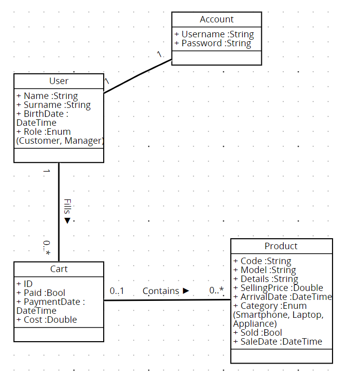

# Requirements Document - current EZElectronics

| Version number |                               Change                               |
| :------------: | :----------------------------------------------------------------: |
|     V1.1.0     |              Adding Context Diagram and Stakeholders               |
|     V1.2.0     | Fixing Stakeholders, Context Diagram and adding user and personas  |
|     v1.2.1     | Fixing Stakeholder, Context Diagram and non functional requirement |
|     v1.3.0     |       Added use case diagram, added use cases and scenarios        |
|     v1.4.0     | Translating NFR and FR and fixing Stakeholders and Context Diagram |
|     v1.4.1     |                      Fixed UML Class Diagram                       |
|     v1.4.2     |                      Fixed UML Class Diagram                       |
|     v1.4.3     |                          Fixed Glossary                            |
|     v1.4.4     |               Added Domain Non Functional Requirements             |
|     v1.4.5     |                          Fixed Glossary                            |
|     v1.4.6     | Removed Database from Interfaces, Stakeholders and Context Diagram |

# Contents

- [Requirements Document - current EZElectronics](#requirements-document---current-ezelectronics)
- [Contents](#contents)
- [Informal description](#informal-description)
- [Stakeholders](#stakeholders)
- [Context Diagram and interfaces](#context-diagram-and-interfaces)
  - [Context Diagram](#context-diagram)
  - [Interfaces](#interfaces)
- [Stories and personas](#stories-and-personas)
    - [Customer](#customer)
    - [Manager](#manager)
- [Functional and non functional requirements](#functional-and-non-functional-requirements)
  - [Functional Requirements](#functional-requirements)
  - [Non Functional Requirements](#non-functional-requirements)
- [Use case diagram and use cases](#use-case-diagram-and-use-cases)
  - [Use case diagram](#use-case-diagram)
    - [Use case 1, Login di un utente (UC1)](#use-case-1-login-di-un-utente-uc1)
        - [Scenario 1.1](#scenario-11)
        - [Scenario 1.2](#scenario-12)
        - [Scenario 1.3](#scenario-13)
        - [Scenario 1.4](#scenario-14)
    - [Use case 2, Logout di un utente (UC2)](#use-case-2-logout-di-un-utente-uc2)
        - [Scenario 2.1](#scenario-21)
        - [Scenario 2.2](#scenario-22)
    - [Use case 3, Creazione di un nuovo utente (UC3)](#use-case-3-creazione-di-un-nuovo-utente-uc3)
        - [Scenario 3.1](#scenario-31)
        - [Scenario 3.2](#scenario-32)
        - [Scenario 3.3](#scenario-33)
    - [Use case 4, Gestione degli utenti (UC4)](#use-case-4-gestione-degli-utenti-uc4)
        - [Scenario 4.1](#scenario-41)
        - [Scenario 4.2](#scenario-42)
        - [Scenario 4.3](#scenario-43)
        - [Scenario 4.4](#scenario-44)
        - [Scenario 4.5](#scenario-45)
        - [Scenario 4.6](#scenario-46)
        - [Scenario 4.7](#scenario-47)
    - [Use case 5, Gestione dei prodotti (UC5)](#use-case-5-gestione-dei-prodotti-uc5)
        - [Scenario 5.1](#scenario-51)
        - [Scenario 5.2](#scenario-52)
        - [Scenario 5.3](#scenario-53)
        - [Scenario 5.4](#scenario-54)
        - [Scenario 5.4.1](#scenario-541)
        - [Scenario 5.4.2](#scenario-542)
        - [Scenario 5.5](#scenario-55)
        - [Scenario 5.6](#scenario-56)
        - [Scenario 5.6.1](#scenario-561)
        - [Scenario 5.6.2](#scenario-562)
        - [Scenario 5.7](#scenario-57)
        - [Scenario 5.7.1](#scenario-571)
        - [Scenario 5.7.2](#scenario-572)
        - [Scenario 5.8](#scenario-58)
        - [Scenario 5.9](#scenario-59)
        - [Scenario 5.10](#scenario-510)
        - [Scenario 5.11](#scenario-511)
        - [Scenario 5.12](#scenario-512)
        - [Scenario 5.13](#scenario-513)
        - [Scenario 5.14](#scenario-514)
        - [Scenario 5.15](#scenario-515)
        - [Scenario 5.16](#scenario-516)
        - [Scenario 5.17](#scenario-517)
    - [Use case 6, Gestione dei carrelli (UC6)](#use-case-6-gestione-dei-carrelli-uc6)
        - [Scenario 6.1](#scenario-61)
        - [Scenario 6.2](#scenario-62)
        - [Scenario 6.3](#scenario-63)
        - [Scenario 6.4](#scenario-64)
        - [Scenario 6.5](#scenario-65)
        - [Scenario 6.6](#scenario-66)
        - [Scenario 6.7](#scenario-67)
        - [Scenario 6.8](#scenario-68)
        - [Scenario 6.9](#scenario-69)
        - [Scenario 6.10](#scenario-610)
        - [Scenario 6.11](#scenario-611)
        - [Scenario 6.12](#scenario-612)
        - [Scenario 6.13](#scenario-613)
        - [Scenario 6.14](#scenario-614)
        - [Scenario 6.15](#scenario-615)
        - [Scenario 6.16](#scenario-616)
- [Glossary](#glossary)
- [System Design](#system-design)
- [Deployment Diagram](#deployment-diagram)

# Informal description

EZElectronics (read EaSy Electronics) is a software application designed to help managers of electronics stores to manage their products and offer them to customers through a dedicated website. Managers can assess the available products, record new ones, and confirm purchases. Customers can see available products, add them to a cart and see the history of their past purchases.

# Stakeholders

| Stakeholder name |                                           Description                                            |
| :--------------: | :----------------------------------------------------------------------------------------------: |
|      Users       |                Persone che utilizzeranno EZElectronics, sia Customer che Manager                 |
|      Owners      | Persone che finanziano EZElectronics e commissionano gli sviluppi applicativi e infrastrutturali |
| Software factory |            Azienda o team che si occupa degli sviluppi applicativi frontend e backend            |
<!-- |     Partners     |          Stores that sell products to the electronic store that will use EZElectronics           | -->

# Context Diagram and interfaces

## Context Diagram

```plantuml
    skinparam backgroundColor #EEEBDC
    actor Customer as c
    actor Manager as m
    c -- (EZElectronics)
    m -- (EZElectronics)
```
<!--  -->

## Interfaces


|  Actor   |          Logical Interface           | Physical Interface |
| :------: | :----------------------------------: | :----------------: |
| Manager  | GUI(managing products and warehouse) |   Smartphone/PC    |
| Customer |         GUI(buying products)         |   Smartphone/PC    |


# Stories and personas

### Customer


Federica, una giovane di 25 anni, si è appena trasferita in una nuova città e si ritrova lontana dal suo negozio di elettronica di fiducia che frequentava nella sua città natale. Era abituata a recarsi personalmente nel negozio per acquistare gli ultimi prodotti elettronici e ricevere consigli tecnici dal personale di vendita. Tuttavia, da quando il suo negozio preferito ha adottato la piattaforma EZElectronics, Federica ha scoperto una nuova comodità nel fare acquisti online. Ora può esplorare il medesimo catalogo di prodotti, direttamente dal suo computer o smartphone, senza doversi preoccupare di essere lontana dalla sua città natale.
Federica utilizza esclusivamente Smartphone e ha un buon livello di confidenza con la tecnologia.

Gianpiero è un professore di 45 anni che lavora a Torino e abita in una seconda casa. 
Il weekend si reca presso la sua prima casa in un paesino nelle Valli di Lanzo e non ha modo di recarsi in un negozio di elettronica, in quanto durante tutta la settimana è impegnato e dove vive non esistono negozi di questo tipo. Da quando ha scoperto EZElectronics riesce comodamente a consultare l’ampio catalogo da casa sua, potendo scegliere tra i prodotti più recenti del mercato.
Gianpiero preferisce consultare la webapp di EZElectronics dal suo laptop. Ha un'ottima confidenza con la tecnologia.

Salvatore è un pensionato di 75 anni che si sta per la prima volta approcciando a dei prodotti elettronici "smart". Recandosi di persona per l'acquisto di un prodotto in negozio trovava difficoltà in quanto i commessi spesso lo confondevano con tanti tecnicismi.
Preferisce molto di più consultare il catalogo dei prodotti da EZElectronics online, grazie all'interfaccia grafica semplice, adatta a qualsiasi tipo di utente.
Salvatore ha una pessima confidenza con il mondo della tecnologia e preferisce consultare il catalogo di prodotti dal suo computer fisso.

### Manager


Francesco, un manager di 46 anni di un negozio di elettronica, si trova ad affrontare una brusca diminuzione delle vendite a causa della concorrenza delle multinazionali e del cambiamento delle abitudini di acquisto degli utenti. Sempre più persone preferiscono fare acquisti comodamente da casa piuttosto che recarsi fisicamente in negozio. Con l'utilizzo di EZElectronics, Francesco ha potuto superare questa sfida tecnologica e mantenere il negozio competitivo sul mercato. EZElectronics ha permesso al negozio di espandere la propria presenza online, migliorare l'esperienza complessiva di acquisto e mantenere la propria rilevanza nel settore dell'elettronica.
Francesco ha una discreta confidenza con la tecnologia, preferisce comunque utilizzare EZElectronics dal suo computer di lavoro.

Giuseppe ha 25 anni ed è neo assunto presso una catena di negozi di elettronica.
Nel negozio dove lui lavora è stata già adottata la piattaforma EZElectronics.
All'inizio era molto preoccupato per eventuali difficoltà da superare nell'apprendimento dell'utilizzo della piattaforma, ma si è dovuto subito ricredere quando ha notato con quale facilità riuscisse a modificare il catalogo dei prodotti sul mercato.
Giuseppe ha una buona confidenza con il mondo della tecnologia. Non ha un dispositivo preferito, consulta EZElectronics sia da computer, sia da smartphone.


# Functional and non functional requirements

## Functional Requirements


|   ID    |                             Description                                |
| :-----: | :--------------------------------------------------------------------: |
| __FR1__ |                 __Autenticazione e autorizzazione__                    |
| • FR1.1 |                                login                                   |
| • FR1.2 |                                logout                                  |
| • FR1.3 |                          creazione utente                              |
| • FR1.4 |             lista delle informazioni dell'utente loggato               |
| __FR2__ |                         __Gestione utente__                            |
| • FR2.1 |                         cancellazione utente                           |
| • FR2.2 |       lista degli utenti (completa, per ruolo o per username)          |
| __FR3__ |                        __Gestione prodotto__                           |
| • FR3.1 |                          creazione prodotto                            |
| • FR3.2 |            creazione di più prodotti dello stesso modello              |
| • FR3.3 |              registrazione di un prodotto come venduto                 |
| • FR3.4 | lista dei prodotti (completa, per codice, per categoria o per modello) |
| • FR3.5 |                        cancellazione prodotto                          |
| __FR4__ |                        __Gestione carrello__                           |
| • FR4.1 |                    aggiunta prodotto al carrello                       |
| • FR4.2 |                       visualizzazione carrello                         |
| • FR4.3 |                    visualizzazione storico ordini                      |
| • FR4.4 |              cancellazione di un prodotto dal carrello                 |
| • FR4.5 |                  cancellazione dell'intero carrello                    |
| • FR4.6 |                  pagamento per il carrello corrente                    |


## Non Functional Requirements


|  ID   | Type (efficiency, reliability, ..) |                                           Description                                           |  Refers to  |
| :---: | :--------------------------------: | :---------------------------------------------------------------------------------------------: | :---------: |
| NFR1  |              security              |                  Il sistema deve essere protetto dagli accessi non autorizzati                  |   All FR    |
| NFR2  |             usability              |            Gli utenti non dovranno effettuare training per utilizzare l'applicazione            |   All FR    |
| NFR3  |            performance             |            Il sistema deve poter gestire l'accesso contemporaneo di almeno 200 utenti           |   All FR    |
| NFR4  |             efficiency             |    Il sito deve avere un tempo di caricamento massimo per il catalogo completo di 3 secondi     | FR3 and FR4 |
| NFR5  |             efficiency             |     Il sito deve avere un tempo di risposta massimo di 1 secondo per i componenti frontend      |   All FR    |
| NFR6  |            portability             |     Il sito deve essere disponibile per i seguenti browser: Chrome, Safari, Opera, Firefox      |   All FR    |
| NFR7  |            reliability             |                     Ogni utente non dovrà riportare più di un bug all'anno                      |   All FR    |
| NFR8  |            reliability             |                        Il sistema deve avere un tempo di uptime di 99,9%                        |   All FR    |
| NFR9  |               domain               |                      Il prezzo di un prodotto non può essere negativo o zero                    |     FR3     |
| NFR10 |               domain               |                L'ID di un prodotto deve essere univoco e avere almeno 6 caratteri               |     FR3     |

# Use case diagram and use cases

## Use case diagram


### Use case 1, Login di un utente (UC1)

| Actors Involved  |            Utente                                       |
| :--------------: | :-----------------------------------------------: |
|   Precondition   | L'utente non è autenticato, l'utente è registrato |
|  Post condition  |              L'utente è autenticato               |
| Nominal Scenario |                   Scenario 1.1                    |
|     Variants     |                                           |
|    Exceptions    |              Scenario 1.2, 1.3, 1.4, 1.5               |

##### Scenario 1.1

|  Scenario 1.1  |                                                            Login                                                             |
| :------------: | :--------------------------------------------------------------------------------------------------------------------------: |
|  Precondition  |                                      L'utente non è autenticato, l'utente è registrato                                       |
| Post condition |                                                    L'utente è autenticato                                                    |
|     Step#      |                                                         Descrizione                                                          |
|       1        |                     L’utente avvia l’interazione con il sistema chiedendo di poter effettuare il login.                      |
|       2        | Il sistema reagisce e chiede all’utente di inserire le informazioni necessarie per effettuare il login: username e password. |
|       3        |                                        L'utente inserisce le informazioni richieste.                                         |
|       4        |              Il sistema legge lo username e la password, controlla se ci sia un cookie associato, l'utente non è autenticato.              |
|       5        | Il sistema ricava la password associata a quello username e la confronta con la password inserita dall'utente. Le 2 password coincidono e quindi il sistema autorizza il login dell'utente. |

##### Scenario 1.2

|  Scenario 1.2  |                                                      Password sbagliata                                                      |
| :------------: | :--------------------------------------------------------------------------------------------------------------------------: |
|  Precondition  |                                      L'utente non è autenticato, l'utente è registrato                                       |
| Post condition |                                                    L'utente non è autenticato                                                    |
|     Step#      |                                                         Descrizione                                                          |
|       1        |                     L’utente avvia l’interazione con il sistema chiedendo di poter effettuare il login.                      |
|       2        | Il sistema reagisce e chiede all’utente di inserire le informazioni necessarie per effettuare il login: username e password. |
|       3        |                                        L'utente inserisce le informazioni richieste.                                         |
|       4        |              Il sistema legge lo username e la password, controlla se ci sia un cookie associato, l'utente non è autenticato.              |
|       5        |              Il sistema dato lo username cerca l'utente e lo trova.            |
|       6        | Il sistema ricava la password associata a quello username e la confronta con la password inserita dall'utente. Le 2 password sono diverse e quindi il sistema non autorizza il login dell'utente e ritorna un messaggio di errore. |

##### Scenario 1.3

|  Scenario 1.3  |                                                      L'utente non è registrato                                                      |
| :------------: | :--------------------------------------------------------------------------------------------------------------------------: |
|  Precondition  |                                      L'utente non è autenticato, l'utente non è registrato                                       |
| Post condition |                                                    L'utente non è autenticato                                                    |
|     Step#      |                                                         Descrizione                                                          |
|       1        |                     L’utente avvia l’interazione con il sistema chiedendo di poter effettuare il login.                      |
|       2        | Il sistema reagisce e chiede all’utente di inserire le informazioni necessarie per effettuare il login: username e password. |
|       3        |                                        L'utente inserisce le informazioni richieste.                                         |
|       4        |              Il sistema legge lo username e la password, controlla se ci sia un cookie associato, l'utente non è autenticato.              |
|       5        |              Il sistema dato lo username cerca l'utente ma non lo trova e quindi non autorizza il login dell'utente e ritorna un messaggio di errore.            |

##### Scenario 1.4

|  Scenario 1.4  |                                                      L'utente è già autenticato                                                      |
| :------------: | :--------------------------------------------------------------------------------------------------------------------------: |
|  Precondition  |                                      L'utente è autenticato, l'utente è registrato                                       |
| Post condition |                                                    L'utente è autenticato                                                    |
|     Step#      |                                                         Descrizione                                                          |
|       1        |                     L’utente avvia l’interazione con il sistema chiedendo di poter effettuare il login.                      |
|       2        | Il sistema reagisce e chiede all’utente di inserire le informazioni necessarie per effettuare il login: username e password. |
|       3        |                                        L'utente inserisce le informazioni richieste.                                         |
|       4        |              Il sistema legge lo username e la password, controlla se ci sia un cookie associato, l'utente è già autenticato.              |
|       5        |              Il sistema ritorna un messaggio di errore.            |


### Use case 2, Logout di un utente (UC2)

| Actors Involved  | Utente                                   |
| :--------------: | :-----------------------------------------------: |
|   Precondition   | L'utente è autenticato |
|  Post condition  | L'utente non è autenticato               |
| Nominal Scenario | Scenario 2.1                    |
|     Variants     |                       |
|    Exceptions    | Scenario 2.2               |

##### Scenario 2.1

|  Scenario 2.1  | Logout                                                             |
| :------------: | :--------------------------------------------------------------------------------------------------------------------------: |
|  Precondition  | L'utente è autenticato                                       |
| Post condition | L'utente non è autenticato                                                    |
|     Step#      | Descrizione                                                          |
|       1        | L’utente avvia l’interazione con il sistema chiedendo di poter effettuare il logout.                      |
|       2        | Il sistema reagisce, controlla il cookie, l'utente è autenticato. |                               
|       3        | Il sistema autorizza il logout dell'utente.            |

##### Scenario 2.2

|  Scenario 2.2  | L'utente ha già fatto il logout                                                      |
| :------------: | :--------------------------------------------------------------------------------------------------------------------------: |
|  Precondition  | L'utente non è autenticato                                     |
| Post condition | L'utente non è autenticato                                                    |
|     Step#      | Descrizione                                                          |
|       1        | L’utente avvia l’interazione con il sistema chiedendo di poter effettuare il logout.                      |
|       2        | Il sistema reagisce, controlla il cookie, l'utente non è autenticato. |                               
|       3        | Il sistema ritorna un messaggio di errore perchè l'utente non ha ancora fatto il login.            |


### Use case 3, Creazione di un nuovo utente (UC3)

| Actors Involved  | Utente                                   |
| :--------------: | :-----------------------------------------------: |
|   Precondition   | L'utente che si vuole creare non ha un account: non deve avere un nome utente che identifichi un utente già presente |
|  Post condition  | L'utente è registrato               |
| Nominal Scenario | Scenario 3.1                    |
|     Variants     |                      |
|    Exceptions    | Scenario 3.2, 3.3              |

##### Scenario 3.1

|  Scenario 3.1  | Registrazione                                                            |
| :------------: | :--------------------------------------------------------------------------------------------------------------------------: |
|  Precondition  | L'utente che si vuole creare non ha un account: non deve avere un nome utente che identifichi un utente già presente |
| Post condition | L'utente è registrato                                                   |
|     Step#      | Descrizione                                                          |
|       1        | L’utente avvia l’interazione con il sistema chiedendo di poter creare un nuovo utente.                      |
|       2        | Il sistema reagisce e chiede all’utente di inserire le informazioni necessarie per la creazione di un nuovo utente: username, nome, cognome, password e ruolo. |                               
|       3        | L’utente inserisce le informazioni richieste.           |
|       4        | Il sistema legge le informazioni inserite dall'utente, controlla se ci sia un cookie associato, l'utente non è autenticato.           |
|       5        | Il sistema controlla che lo username inserito dall'utente non sia già associato a un altro account, lo username non è ancora stato usato. |  
|       6        | Il sistema crea il nuovo utente e salva le informazioni.           |

##### Scenario 3.2

|  Scenario 3.2  | L'utente è già registrato                                                      |
| :------------: | :--------------------------------------------------------------------------------------------------------------------------: |
|  Precondition  | L'utente è registrato                                     |
| Post condition | L'utente è registrato                                                    |
|     Step#      | Descrizione                                                          |
|       1        | L’utente avvia l’interazione con il sistema chiedendo di poter creare un nuovo utente.                      |
|       2        | Il sistema reagisce e chiede all’utente di inserire le informazioni necessarie per la creazione di un nuovo utente: username, nome, cognome, password e ruolo. |                               
|       3        | L’utente inserisce le informazioni richieste.           |
|       4        | Il sistema legge le informazioni inserite dall'utente, controlla se ci sia un cookie associato, l'utente non è autenticato.           |
|       5        | Il sistema controlla che lo username inserito dall'utente non sia già associato a un altro account, lo username è già stato usato, il sistema ritorna un messaggio di errore. |

##### Scenario 3.3

|  Scenario 3.3  | L'utente è già autenticato                                                      |
| :------------: | :--------------------------------------------------------------------------------------------------------------------------: |
|  Precondition  | L'utente è autenticato, l'utente è registrato                                     |
| Post condition | L'utente è autenticato                                                    |
|     Step#      | Descrizione                                                          |
|       1        | L’utente avvia l’interazione con il sistema chiedendo di poter creare un nuovo utente.                      |
|       2        | Il sistema reagisce e chiede all’utente di inserire le informazioni necessarie per la creazione di un nuovo utente: username, nome, cognome, password e ruolo. |                               
|       3        | L’utente inserisce le informazioni richieste.           |
|       4        | Il sistema legge le informazioni inserite dall'utente, controlla se ci sia un cookie associato, l'utente è già autenticato.           |
|       5        | Il sistema ritorna un messaggio di errore. |


### Use case 4, Gestione degli utenti (UC4)

| Actors Involved  | Utente                                   |
| :--------------: | :-----------------------------------------------: |
|   Precondition   | Nessuna (per 4.2, 4.3, 4.4, 4.5), l’utente dev’essersi già autenticato (per 4.1) |
|  Post condition  | Sono state recuperate le informazioni sull'utente attualmente autenticato, sono stati ritornati tutti gli utenti, sono stati ritornati tutti gli utenti con un ruolo specifico, è stato ritornato l’utente identificato dal nome utente richiesto, è stato eliminato l’utente identificato dal nome utente inserito               |
| Nominal Scenario | Scenario 4.1, 4.2, 4.3, 4.4, 4.5                   |
|     Variants     |                      |
|    Exceptions    | Exceptions di 4.4: 4.6, exceptions di 4.5: 4.7             |

##### Scenario 4.1

|  Scenario 4.1  | Recupero delle informazioni dell'utente attualmente autenticato                                                            |
| :------------: | :--------------------------------------------------------------------------------------------------------------------------: |
|  Precondition  | L’utente dev’essersi già autenticato |
| Post condition | Sono state recuperate le informazioni sull'utente attualmente autenticato                                                   |
|     Step#      | Descrizione                                                          |
|       1        | L’utente avvia l’interazione con il sistema chiedendo di poter recuperare le informazioni che lo descrivono.                      |
|       2        | Il sistema reagisce e fornisce all’utente le informazioni che lo descrivono: username, nome, cognome e ruolo. |                          

##### Scenario 4.2

|  Scenario 4.2  | Recupero di tutti gli utenti                                                  |
| :------------: | :--------------------------------------------------------------------------------------------------------------------------: |
|  Precondition  |                                      |
| Post condition | Sono stati ritornati tutti gli utenti                                                   |
|     Step#      | Descrizione                                                          |
|       1        | L’utente avvia l’interazione con il sistema chiedendo di poter avere l’elenco di tutti gli utenti.                    |
|       2        | Il sistema ritorna tutti gli utenti e le informazioni che li descrivono: username, nome, cognome e ruolo. |                             

##### Scenario 4.3

|  Scenario 4.3  | Recupero di tutti gli utenti con un ruolo specifico                                                |
| :------------: | :--------------------------------------------------------------------------------------------------------------------------: |
|  Precondition  |                                      |
| Post condition | Sono stati ritornati tutti gli utenti con un ruolo specifico                                                  |
|     Step#      | Descrizione                                                          |
|       1        | L’utente avvia l’interazione con il sistema chiedendo di poter avere l’elenco di tutti gli utenti con un ruolo specifico.                   |
|       2        | Il sistema reagisce e chiede all’utente di inserire tale ruolo. | 
|       3        | L’utente inserisce le informazioni richieste. | 
|       4        | Il sistema valida le informazioni e ritorna tutti gli utenti con quel ruolo specifico e le informazioni che li descrivono: username, nome, cognome e ruolo. | 

##### Scenario 4.4

|  Scenario 4.4  | Recupero dell’utente identificato da un certo nome utente                                                  |
| :------------: | :--------------------------------------------------------------------------------------------------------------------------: |
|  Precondition  |                                      |
| Post condition | E’ stato ritornato l’utente identificato dal nome utente richiesto.                                                   |
|     Step#      | Descrizione                                                          |
|       1        | L’utente avvia l’interazione con il sistema chiedendo di poter avere le informazioni che descrivono un certo utente.                   |
|       2        | Il sistema reagisce e chiede all’utente di inserire il nome utente di tale utente. |
|       3        | L’utente inserisce le informazioni richieste. |
|       4        | Il sistema valida le informazioni e ritorna l’utente identificato dal nome utente richiesto. |


##### Scenario 4.5

|  Scenario 4.5  | Eliminazione di un utente identificato da un certo nome utente                                                  |
| :------------: | :--------------------------------------------------------------------------------------------------------------------------: |
|  Precondition  |                                      |
| Post condition | L'utente identificato dal nome utente richiesto è stato eliminato                                                   |
|     Step#      | Descrizione                                                          |
|       1        | L’utente avvia l’interazione con il sistema chiedendo di poter eliminare un certo utente.                   |
|       2        | Il sistema reagisce e chiede all’utente di inserire il nome utente di tale utente. | 
|       3        | L’utente inserisce le informazioni richieste. |
|       4        | Il sistema valida le informazioni ed elimina tale utente. |


##### Scenario 4.6

|  Scenario 4.6  | Recupero dell’utente identificato da un certo nome utente (il nome utente non identifica un utente già presente) |
| :------------: | :--------------------------------------------------------------------------------------------------------------------------: |
|  Precondition  |                                      |
| Post condition | Non è stato ritornato l’utente identificato dal nome utente richiesto.                                                   |
|     Step#      | Descrizione                                                          |
|       1        | L’utente avvia l’interazione con il sistema chiedendo di poter avere le informazioni che descrivono un certo utente.                   |
|       2        | Il sistema reagisce e chiede all’utente di inserire il nome utente di tale utente. |
|       3        | L’utente inserisce le informazioni richieste. |
|       4        | Il sistema valida le informazioni ma l’utente è identificato da un nome utente che non è presente, il sistema mostra un messaggio di errore e termina con fallimento. |


##### Scenario 4.7

|  Scenario 4.7  | Eliminazione di un utente identificato da un certo nome utente (il nome utente non identifica un utente già presente) |
| :------------: | :--------------------------------------------------------------------------------------------------------------------------: |
|  Precondition  |                              |
| Post condition | Non è stato eliminato l’utente identificato dal nome utente inserito perchè tale utente non è presente      |
|     Step#      | Descrizione                                                          |
|       1        | L’utente avvia l’interazione con il sistema chiedendo di poter eliminare un certo utente.                   |
|       2        | Il sistema reagisce e chiede all’utente di inserire il nome utente di tale utente. | 
|       3        | L’utente inserisce le informazioni richieste. |
|       4        | Il sistema valida le informazioni ma l’utente è identificato da un nome utente che non è presente, il sistema mostra un messaggio di errore e termina con fallimento. |


### Use case 5, Gestione dei prodotti (UC5)

| Actors Involved  | Utente                                   |
| :--------------: | :-----------------------------------------------: |
|   Precondition   | Solo un utente autenticato può accedere a questa funzione (per 5.4 e varianti, 5.5, 5.6 e varianti, 5.7 e varianti), solo un utente autenticato il cui ruolo è Manager può accedere a questa funzione (per 5.1, 5.2, 5.3, 5.8) |
|  Post condition  | E’ stato creato un nuovo prodotto con le informazioni fornite, è stato registrato l’arrivo dei prodotti indicati, il prodotto venduto è stato contrassegnato come tale, sono stati ritornati tutti i prodotti, è stato ritornato il prodotto identificato dal codice prodotto richiesto, sono stati ritornati tutti i prodotti della categoria richiesta, sono stati ritornati tutti i prodotti del modello richiesto, è stato eliminato il prodotto identificato dal codice prodotto inserito                |
| Nominal Scenario | Scenario 5.1, 5.2, 5.3, 5.4, 5.5, 5.6, 5.7, 5.8                   |
|     Variants     | Varianti di 5.4: 5.4.1, 5.4.2, varianti di 5.6: 5.6.1, 5.6.2, varianti di 5.7: 5.7.1, 5.7.2                   |
|    Exceptions    | Exceptions di 5.1: 5.9, 5.10, exceptions di 5.2: 5.11, exceptions di 5.3: 5.12, 5.13, 5.14, 5.15, exceptions di 5.5: 5.16, exceptions di 5.8: 5.17 |


##### Scenario 5.1

|  Scenario 5.1  | Creazione di un nuovo prodotto                                                           |
| :------------: | :--------------------------------------------------------------------------------------------------------------------------: |
|  Precondition  | Solo un utente autenticato il cui ruolo è Manager può accedere a questa funzione |
| Post condition | E’ stato creato un nuovo prodotto con le informazioni fornite                                          |
|     Step#      | Descrizione                                                          |
|       1        | L’utente avvia l’interazione con il sistema chiedendo di poter creare un nuovo prodotto.                      |
|       2        | Il sistema reagisce e chiede all’utente di inserire le informazioni necessarie per la creazione di un nuovo prodotto: codice, prezzo di vendita, modello, categoria, dettagli e data di arrivo. |  
|       3        | L’utente inserisce le informazioni richieste.                      |
|       4        | Il sistema valida le informazioni, crea il nuovo prodotto e salva le informazioni.                     |


##### Scenario 5.2

|  Scenario 5.2  | Registrazione dell'arrivo di 1 o più prodotti dello stesso modello                                                  |
| :------------: | :--------------------------------------------------------------------------------------------------------------------------: |
|  Precondition  | Solo un utente autenticato il cui ruolo è Manager può accedere a questa funzione                                   |
| Post condition | E’ stato registrato l’arrivo dei prodotti indicati                                                   |
|     Step#      | Descrizione                                                          |
|       1        | L’utente avvia l’interazione con il sistema chiedendo di poter registrare l’arrivo di 1 o più prodotti dello stesso modello.    |
|       2        | Il sistema reagisce e chiede all’utente di inserire le informazioni necessarie per la registrazione dell'arrivo di 1 o più prodotti dello stesso modello: modello, categoria, dettagli, quantità, data di arrivo, prezzo di vendita. |     
|       3        | L’utente inserisce le informazioni richieste.                      |
|       4        | Il sistema valida le informazioni e registra l'arrivo dei prodotti indicati.   |


##### Scenario 5.3

|  Scenario 5.3  | Contrassegnazione di un prodotto come venduto                                                |
| :------------: | :--------------------------------------------------------------------------------------------------------------------------: |
|  Precondition  | Solo un utente autenticato il cui ruolo è Manager può accedere a questa funzione                                     |
| Post condition | Il prodotto venduto è stato contrassegnato come tale                                                  |
|     Step#      | Descrizione                                                          |
|       1        | L’utente avvia l’interazione con il sistema chiedendo di poter contrassegnare come venduto un prodotto.                   |
|       4        | Il sistema contrassegna il prodotto identificato da tale codice come venduto. | 


##### Scenario 5.4

|  Scenario 5.4  | Recupero di tutti i prodotti                                                  |
| :------------: | :--------------------------------------------------------------------------------------------------------------------------: |
|  Precondition  | Solo un utente autenticato può accedere a questa funzione                                 |
| Post condition | Sono stati ritornati tutti i prodotti                                                 |
|     Step#      | Descrizione                                                          |
|       1        | L’utente avvia l’interazione con il sistema chiedendo di poter avere l’elenco di tutti i prodotti.                   |
|       2        | Il sistema ritorna tutti i prodotti e le informazioni che li descrivono: codice, prezzo di vendita, modello, categoria, dettagli e data di arrivo. |


##### Scenario 5.4.1

|  Scenario 5.4.1  | Recupero di tutti i prodotti venduti                                           |
| :------------: | :--------------------------------------------------------------------------------------------------------------------------: |
|  Precondition  | Solo un utente autenticato può accedere a questa funzione                                    |
| Post condition | Sono stati ritornati tutti i prodotti venduti                                                  |
|     Step#      | Descrizione                                                          |
|       1        | L’utente avvia l’interazione con il sistema chiedendo di poter avere l’elenco di tutti i prodotti venduti.                   |
|       2        | Il sistema ritorna tutti i prodotti venduti e le informazioni che li descrivono: codice, prezzo di vendita, modello, categoria, dettagli e data di arrivo. |


##### Scenario 5.4.2

|  Scenario 5.4.2  | Recupero di tutti i prodotti non venduti                                                |
| :------------: | :--------------------------------------------------------------------------------------------------------------------------: |
|  Precondition  | Solo un utente autenticato può accedere a questa funzione                                     |
| Post condition | Sono stati ritornati tutti i prodotti non venduti                                              |
|     Step#      | Descrizione                                                          |
|       1        | L’utente avvia l’interazione con il sistema chiedendo di poter avere l’elenco di tutti i prodotti non venduti.                   |
|       2        | Il sistema ritorna tutti i prodotti non venduti e le informazioni che li descrivono: codice, prezzo di vendita, modello, categoria, dettagli e data di arrivo. |


##### Scenario 5.5

|  Scenario 5.5  | Recupero del prodotto identificato da un certo codice                                                  |
| :------------: | :--------------------------------------------------------------------------------------------------------------------------: |
|  Precondition  | Solo un utente autenticato può accedere a questa funzione                                     |
| Post condition | E’ stato ritornato il prodotto identificato dal codice prodotto richiesto                                                   |
|     Step#      | Descrizione                                                          |
|       1        | L’utente avvia l’interazione con il sistema chiedendo di poter avere le informazioni che descrivono un certo prodotto.                   |
|       2        | Il sistema ritorna il prodotto identificato dal codice prodotto richiesto e le informazioni che lo descrivono: codice, prezzo di vendita, modello, categoria, dettagli e data di arrivo. |


##### Scenario 5.6

|  Scenario 5.6  | Recupero di tutti i prodotti appartenenti a una categoria specifica                                                  |
| :------------: | :--------------------------------------------------------------------------------------------------------------------------: |
|  Precondition  | Solo un utente autenticato può accedere a questa funzione                                     |
| Post condition | Sono stati ritornati tutti i prodotti della categoria richiesta                                                   |
|     Step#      | Descrizione                                                          |
|       1        | L’utente avvia l’interazione con il sistema chiedendo di poter avere l’elenco di tutti i prodotti appartenenti a una certa categoria. |
|       2        | Il sistema reagisce e chiede all’utente di inserire tale categoria. | 
|       3        | L’utente inserisce l'informazione richiesta. |
|       4        | Il sistema valida le informazioni e ritorna tutti i prodotti della categoria richiesta e le informazioni che li descrivono: codice, prezzo di vendita, modello, categoria, dettagli e data di arrivo. |


##### Scenario 5.6.1

|  Scenario 5.6.1  | Recupero di tutti i prodotti venduti appartenenti a una categoria specifica                                                  |
| :------------: | :--------------------------------------------------------------------------------------------------------------------------: |
|  Precondition  | Solo un utente autenticato può accedere a questa funzione                                     |
| Post condition | Sono stati ritornati tutti i prodotti venduti della categoria richiesta                                                   |
|     Step#      | Descrizione                                                          |
|       1        | L’utente avvia l’interazione con il sistema chiedendo di poter avere l’elenco di tutti i prodotti venduti appartenenti a una certa categoria. |
|       2        | Il sistema reagisce e chiede all’utente di inserire tale categoria. | 
|       3        | L’utente inserisce l'informazione richiesta. |
|       4        | Il sistema valida le informazioni e ritorna tutti i prodotti venduti della categoria richiesta e le informazioni che li descrivono: codice, prezzo di vendita, modello, categoria, dettagli e data di arrivo. 


##### Scenario 5.6.2

|  Scenario 5.6.2  | Recupero di tutti i prodotti non venduti appartenenti a una categoria specifica                                                  |
| :------------: | :--------------------------------------------------------------------------------------------------------------------------: |
|  Precondition  | Solo un utente autenticato può accedere a questa funzione                                     |
| Post condition | Sono stati ritornati tutti i prodotti non venduti della categoria richiesta                                                   |
|     Step#      | Descrizione                                                          |
|       1        | L’utente avvia l’interazione con il sistema chiedendo di poter avere l’elenco di tutti i prodotti non venduti appartenenti a una certa categoria. |
|       2        | Il sistema reagisce e chiede all’utente di inserire tale categoria. | 
|       3        | L’utente inserisce l'informazione richiesta. |
|       4        | Il sistema valida le informazioni e ritorna tutti i prodotti non venduti della categoria richiesta e le informazioni che li descrivono: codice, prezzo di vendita, modello, categoria, dettagli e data di arrivo. 


##### Scenario 5.7

|  Scenario 5.7  | Recupero di tutti i prodotti di un modello specifico                                                  |
| :------------: | :--------------------------------------------------------------------------------------------------------------------------: |
|  Precondition  | Solo un utente autenticato può accedere a questa funzione                                     |
| Post condition | Sono stati ritornati tutti i prodotti del modello richiesto                                                   |
|     Step#      | Descrizione                                                          |
|       1        | L’utente avvia l’interazione con il sistema chiedendo di poter avere l’elenco di tutti i prodotti di un certo modello.                   |
|       2        | Il sistema reagisce e chiede all’utente di inserire tale modello. | 
|       3        | L’utente inserisce l'informazione richiesta. |
|       4        | Il sistema valida le informazioni e ritorna tutti i prodotti del modello richiesto e le informazioni che li descrivono: codice, prezzo di vendita, modello, categoria, dettagli e data di arrivo. |


##### Scenario 5.7.1

|  Scenario 5.7.1 | Recupero di tutti i prodotti venduti di un modello specifico                                                  |
| :------------: | :--------------------------------------------------------------------------------------------------------------------------: |
|  Precondition  | Solo un utente autenticato può accedere a questa funzione                                     |
| Post condition | Sono stati ritornati tutti i prodotti venduti del modello richiesto                                                   |
|     Step#      | Descrizione                                                          |
|       1        | L’utente avvia l’interazione con il sistema chiedendo di poter avere l’elenco di tutti i prodotti venduti di un certo modello.             |
|       2        | Il sistema reagisce e chiede all’utente di inserire tale modello. | 
|       3        | L’utente inserisce l'informazione richiesta. |
|       4        | Il sistema valida le informazioni e ritorna tutti i prodotti venduti del modello richiesto e le informazioni che li descrivono: codice, prezzo di vendita, modello, categoria, dettagli e data di arrivo. |


##### Scenario 5.7.2

|  Scenario 5.7.2  | Recupero di tutti i prodotti non venduti di un modello specifico                                                  |
| :------------: | :--------------------------------------------------------------------------------------------------------------------------: |
|  Precondition  | Solo un utente autenticato può accedere a questa funzione                                     |
| Post condition | Sono stati ritornati tutti i prodotti non venduti del modello richiesto                                                   |
|     Step#      | Descrizione                                                          |
|       1        | L’utente avvia l’interazione con il sistema chiedendo di poter avere l’elenco di tutti i prodotti non venduti di un certo modello.          |
|       2        | Il sistema reagisce e chiede all’utente di inserire tale modello. | 
|       3        | L’utente inserisce l'informazione richiesta. |
|       4        | Il sistema valida le informazioni e ritorna tutti i prodotti non venduti del modello richiesto e le informazioni che li descrivono: codice, prezzo di vendita, modello, categoria, dettagli e data di arrivo. |


##### Scenario 5.8

|  Scenario 5.8  | Eliminazione del prodotto identificato da un certo codice                                                  |
| :------------: | :--------------------------------------------------------------------------------------------------------------------------: |
|  Precondition  | Solo un utente autenticato il cui ruolo è Manager può accedere a questa funzione                                     |
| Post condition | E’ stato eliminato il prodotto identificato dal codice prodotto inserito                                                   |
|     Step#      | Descrizione                                                          |
|       1        | L’utente avvia l’interazione con il sistema chiedendo di poter eliminare un certo prodotto.                   |
|       2        | Il sistema elimina tale prodotto. |


##### Scenario 5.9

|  Scenario 5.9  | Creazione di un nuovo prodotto (il codice prodotto identifica un prodotto già presente) |
| :------------: | :--------------------------------------------------------------------------------------------------------------------------: |
|  Precondition  | Solo un utente autenticato il cui ruolo è Manager può accedere a questa funzione |
| Post condition | Non è stato creato un nuovo prodotto con le informazioni fornite                                          |
|     Step#      | Descrizione                                                          |
|       1        | L’utente avvia l’interazione con il sistema chiedendo di poter creare un nuovo prodotto.                      |
|       2        | Il sistema reagisce e chiede all’utente di inserire le informazioni necessarie per la creazione di un nuovo prodotto: codice, prezzo di vendita, modello, categoria, dettagli e data di arrivo. |  
|       3        | L’utente inserisce le informazioni richieste.                      |
|       4        | Il sistema valida le informazioni ma il prodotto è identificato da un codice prodotto che è già presente, il sistema mostra un messaggio di errore e termina con fallimento.         |


##### Scenario 5.10

|  Scenario 5.10  | Creazione di un nuovo prodotto (la data di arrivo del prodotto è successiva alla data corrente) |
| :------------: | :--------------------------------------------------------------------------------------------------------------------------: |
|  Precondition  | Solo un utente autenticato il cui ruolo è Manager può accedere a questa funzione |
| Post condition | Non è stato creato un nuovo prodotto con le informazioni fornite                                          |
|     Step#      | Descrizione                                                          |
|       1        | L’utente avvia l’interazione con il sistema chiedendo di poter creare un nuovo prodotto.                      |
|       2        | Il sistema reagisce e chiede all’utente di inserire le informazioni necessarie per la creazione di un nuovo prodotto: codice, prezzo di vendita, modello, categoria, dettagli e data di arrivo. |  
|       3        | L’utente inserisce le informazioni richieste.                      |
|       4        | Il sistema valida le informazioni ma la data di arrivo del prodotto è successiva alla data corrente, il sistema mostra un messaggio di errore e termina con fallimento.         |


##### Scenario 5.11

|  Scenario 5.11  | Registrazione dell'arrivo di 1 o più prodotti dello stesso modello (la data di arrivo dei prodotti è successiva alla data corrente)  |
| :------------: | :--------------------------------------------------------------------------------------------------------------------------: |
|  Precondition  | Solo un utente autenticato il cui ruolo è Manager può accedere a questa funzione                                   |
| Post condition | Non è stato registrato l’arrivo dei prodotti indicati                                                   |
|     Step#      | Descrizione                                                          |
|       1        | L’utente avvia l’interazione con il sistema chiedendo di poter registrare l’arrivo di 1 o più prodotti dello stesso modello.    |
|       2        | Il sistema reagisce e chiede all’utente di inserire le informazioni necessarie per la registrazione dell'arrivo di 1 o più prodotti dello stesso modello: modello, categoria, dettagli, quantità, data di arrivo, prezzo di vendita. |     
|       3        | L’utente inserisce le informazioni richieste.                      |
|       4        | Il sistema valida le informazioni ma la data di arrivo dei prodotti è successiva alla data corrente, il sistema mostra un messaggio di errore e termina con fallimento.   |


##### Scenario 5.12

|  Scenario 5.12  | Contrassegnazione di un prodotto come venduto (il codice prodotto non identifica un prodotto già presente) |
| :------------: | :--------------------------------------------------------------------------------------------------------------------------: |
|  Precondition  | Solo un utente autenticato il cui ruolo è Manager può accedere a questa funzione                                     |
| Post condition | Il prodotto venduto non è stato contrassegnato come tale                                                  |
|     Step#      | Descrizione                                                          |
|       1        | L’utente avvia l’interazione con il sistema chiedendo di poter contrassegnare come venduto un prodotto.                   |
|       2        | Il codice del prodotto non identifica nessun prodotto presente, il sistema mostra un messaggio di errore e termina con fallimento.  | 


##### Scenario 5.13

|  Scenario 5.13  | Contrassegnazione di un prodotto come venduto (la data di vendita è successiva alla data corrente) |
| :------------: | :--------------------------------------------------------------------------------------------------------------------------: |
|  Precondition  | Solo un utente autenticato il cui ruolo è Manager può accedere a questa funzione                                     |
| Post condition | Il prodotto venduto non è stato contrassegnato come tale                                                  |
|     Step#      | Descrizione                                                          |
|       1        | L’utente avvia l’interazione con il sistema chiedendo di poter contrassegnare come venduto un prodotto.                   |
|       2        | Il sistema recupera tale prodotto ma la data di vendita è successiva alla data corrente, il sistema mostra un messaggio di errore e termina con fallimento.  | 


##### Scenario 5.14

|  Scenario 5.14  | Contrassegnazione di un prodotto come venduto (la data di vendita è precedente alla data di arrivo) |
| :------------: | :--------------------------------------------------------------------------------------------------------------------------: |
|  Precondition  | Solo un utente autenticato il cui ruolo è Manager può accedere a questa funzione                                     |
| Post condition | Il prodotto venduto non è stato contrassegnato come tale                                                  |
|     Step#      | Descrizione                                                          |
|       1        | L’utente avvia l’interazione con il sistema chiedendo di poter contrassegnare come venduto un prodotto.                   |
|       2        | Il sistema recupera tale prodotto ma la data di vendita è precedente alla data di arrivo, il sistema mostra un messaggio di errore e termina con fallimento.  | 


##### Scenario 5.15

|  Scenario 5.15  | Contrassegnazione di un prodotto come venduto (il prodotto è già stato venduto) |
| :------------: | :--------------------------------------------------------------------------------------------------------------------------: |
|  Precondition  | Solo un utente autenticato il cui ruolo è Manager può accedere a questa funzione                                     |
| Post condition | Il prodotto venduto è già stato contrassegnato come tale                                                  |
|     Step#      | Descrizione                                                          |
|       1        | L’utente avvia l’interazione con il sistema chiedendo di poter contrassegnare come venduto un prodotto.                   |
|       2        | Il sistema recupera tale prodotto ma il prodotto è già stato venduto, il sistema mostra un messaggio di errore e termina con fallimento.  |


##### Scenario 5.16

|  Scenario 5.16  | Recupero del prodotto identificato da un certo codice (il codice prodotto non identifica un prodotto già presente) |
| :------------: | :--------------------------------------------------------------------------------------------------------------------------: |
|  Precondition  | Solo un utente autenticato può accedere a questa funzione                                     |
| Post condition | Non è stato ritornato il prodotto identificato dal codice prodotto richiesto                                                   |
|     Step#      | Descrizione                                                          |
|       1        | L’utente avvia l’interazione con il sistema chiedendo di poter avere le informazioni che descrivono un certo prodotto.                   |
|       2        | Il sistema valida le informazioni ma il codice del prodotto non identifica nessun prodotto presente, il sistema mostra un messaggio di errore e termina con fallimento. |


##### Scenario 5.17

|  Scenario 5.17  | Eliminazione del prodotto identificato da un certo codice (il codice prodotto non identifica un prodotto già presente) |
| :------------: | :--------------------------------------------------------------------------------------------------------------------------: |
|  Precondition  | Solo un utente autenticato il cui ruolo è Manager può accedere a questa funzione                                     |
| Post condition | Non è stato eliminato il prodotto identificato dal codice prodotto inserito perchè tale prodotto non è presente    |
|     Step#      | Descrizione                                                          |
|       1        | L’utente avvia l’interazione con il sistema chiedendo di poter eliminare un certo prodotto.                   |
|       2        | Il codice del prodotto non identifica nessun prodotto presente, il sistema mostra un messaggio di errore e termina con fallimento. |


### Use case 6, Gestione dei carrelli (UC6)

| Actors Involved  | Utente                                   |
| :--------------: | :-----------------------------------------------: |
|   Precondition   | Solo un utente autenticato il cui ruolo è Customer può accedere a questa funzione |
|  Post condition  | E’ stato restituito il carrello attuale dell’utente autenticato, è stato effettuato il pagamento del carrello attuale dell'utente autenticato, è stato aggiunto un prodotto al carrello attuale dell’utente autenticato, è stata recuperata la cronologia dei carrelli che sono stati pagati dall'utente corrente (il carrello attuale non è incluso nell'elenco), è stato eliminato il prodotto richiesto dal carrello attuale dell’utente, è stato eliminato il carrello attuale dell’utente autenticatoautenticato          |
| Nominal Scenario | Scenario 6.1, 6.2, 6.3, 6.4, 6.5, 6.6                 |
|     Variants     |                    |
|    Exceptions    | Exceptions di 6.3: 6.7, 6.8, 6.9, exceptions di 6.2: 6.10, 6.11, exceptions di 6.5: 6.12, 6.13, 6.14, 6.15, exceptions di 6.6: 6.16 |

##### Scenario 6.1

|  Scenario 6.1  | Recupero del carrello attuale dell'utente autenticato                                                           |
| :------------: | :--------------------------------------------------------------------------------------------------------------------------: |
|  Precondition  | Solo un utente autenticato il cui ruolo è Customer può accedere a questa funzione |
| Post condition | E’ stato restituito il carrello attuale dell’utente autenticato                                                   |
|     Step#      | Descrizione                                                          |
|       1        | L’utente avvia l’interazione con il sistema chiedendo di poter avere il carrello attuale dell’utente autenticato.                      |
|       2        | Il sistema reagisce e ritorna il carrello dell'utente attualmente autenticato, che contiene l’elenco di tutti i prodotti inseriti finora nel carrello. |  

##### Scenario 6.2

|  Scenario 6.2  | Pagamento del carrello attuale dell'utente autenticato                                                |
| :------------: | :--------------------------------------------------------------------------------------------------------------------------: |
|  Precondition  | Solo un utente autenticato il cui ruolo è Customer può accedere a questa funzione                                     |
| Post condition | E’ stato effettuato il pagamento del carrello attuale dell'utente autenticato                                                  |
|     Step#      | Descrizione                                                          |
|       1        | L’utente avvia l’interazione con il sistema chiedendo di poter pagare il carrello attuale.                   |
|       2        | Il sistema reagisce, recupera il carrello attuale (scenario 6.1) e calcola il prezzo totale del carrello come somma dei prezzi di ogni prodotto incluso nel carrello e assegna come data di pagamento la data corrente. |


##### Scenario 6.3

|  Scenario 6.3  | Aggiunta di un prodotto al carrello attuale dell’utente autenticato                                                  |
| :------------: | :--------------------------------------------------------------------------------------------------------------------------: |
|  Precondition  | Solo un utente autenticato il cui ruolo è Customer può accedere a questa funzione                                 |
| Post condition | E’ stato aggiunto un prodotto al carrello attuale dell’utente autenticato                                                 |
|     Step#      | Descrizione                                                          |
|       1        | L’utente avvia l’interazione con il sistema chiedendo di poter aggiungere un prodotto al carrello attuale.                  |
|       2        | Il sistema aggiunge il prodotto al carrello dell’utente autenticato. |

##### Scenario 6.4

|  Scenario 6.4  | Recupero della cronologia dei carrelli che sono stati pagati dall'utente corrente                                                  |
| :------------: | :--------------------------------------------------------------------------------------------------------------------------: |
|  Precondition  | Solo un utente autenticato il cui ruolo è Customer può accedere a questa funzione                                   |
| Post condition | E’ stata recuperata la cronologia dei carrelli che sono stati pagati dall'utente corrente (il carrello attuale non è incluso nell'elenco)                                                  |
|     Step#      | Descrizione                                                          |
|       1        | L’utente avvia l’interazione con il sistema chiedendo di poter avere la cronologia dei carrelli che sono stati da lui pagati.    |
|       2        | Il sistema reagisce e ritorna la cronologia dei carrelli che sono stati pagati dall'utente corrente. |     

##### Scenario 6.5

|  Scenario 6.5  | Eliminazione di un prodotto del carrello attuale dell’utente autenticato                                                  |
| :------------: | :--------------------------------------------------------------------------------------------------------------------------: |
|  Precondition  | Solo un utente autenticato il cui ruolo è Customer può accedere a questa funzione                                   |
| Post condition | E’ stato eliminato il prodotto richiesto dal carrello attuale dell’utente autenticato                                                   |
|     Step#      | Descrizione                                                          |
|       1        | L’utente avvia l’interazione con il sistema chiedendo di poter eliminare un certo prodotto dal proprio carrello attuale.                   |
|       2        | Il sistema elimina tale prodotto. |

##### Scenario 6.6

|  Scenario 6.6  | Eliminazione del carrello attuale dell'utente autenticato                                                  |
| :------------: | :--------------------------------------------------------------------------------------------------------------------------: |
|  Precondition  | Solo un utente autenticato il cui ruolo è Customer può accedere a questa funzione                                     |
| Post condition | E’ stato eliminato il carrello attuale dell’utente autenticato                                                   |
|     Step#      | Descrizione                                                          |
|       1        | L’utente avvia l’interazione con il sistema chiedendo di poter eliminare il proprio carrello attuale. |
|       2        | Il sistema elimina tale carrello. | 


##### Scenario 6.7

|  Scenario 6.7  | Aggiunta di un prodotto al carrello attuale dell’utente autenticato (il codice prodotto non identifica un prodotto già presente) |
| :------------: | :--------------------------------------------------------------------------------------------------------------------------: |
|  Precondition  | Solo un utente autenticato il cui ruolo è Customer può accedere a questa funzione                                 |
| Post condition | Non è stato aggiunto un prodotto al carrello attuale dell’utente autenticato                                                 |
|     Step#      | Descrizione                                                          |
|       1        | L’utente avvia l’interazione con il sistema chiedendo di poter aggiungere un prodotto al carrello attuale.                  |
|       2        | Il codice del prodotto non identifica nessun prodotto presente, il sistema mostra un messaggio di errore e termina con fallimento. |


##### Scenario 6.8

|  Scenario 6.8  | Aggiunta di un prodotto al carrello attuale dell’utente autenticato (il codice prodotto identifica un prodotto che è già in un altro carrello) |
| :------------: | :--------------------------------------------------------------------------------------------------------------------------: |
|  Precondition  | Solo un utente autenticato il cui ruolo è Customer può accedere a questa funzione                                 |
| Post condition | Non è stato aggiunto un prodotto al carrello attuale dell’utente autenticato                                                 |
|     Step#      | Descrizione                                                          |
|       1        | L’utente avvia l’interazione con il sistema chiedendo di poter aggiungere un prodotto al carrello attuale.                  |
|       2        | Il codice prodotto identifica un prodotto che è già in un altro carrello, il sistema mostra un messaggio di errore e termina con fallimento. |


##### Scenario 6.9

|  Scenario 6.9  | Aggiunta di un prodotto al carrello attuale dell’utente autenticato (il codice prodotto identifica un prodotto che è già stato venduto) |
| :------------: | :--------------------------------------------------------------------------------------------------------------------------: |
|  Precondition  | Solo un utente autenticato il cui ruolo è Customer può accedere a questa funzione                                 |
| Post condition | Non è stato aggiunto un prodotto al carrello attuale dell’utente autenticato                                                 |
|     Step#      | Descrizione                                                          |
|       1        | L’utente avvia l’interazione con il sistema chiedendo di poter aggiungere un prodotto al carrello attuale.                  |
|       2        | Il sistema recupera tale prodotto ma il codice prodotto identifica un prodotto che è già stato venduto, il sistema mostra un messaggio di errore e termina con fallimento. |


##### Scenario 6.10

|  Scenario 6.10  | Pagamento del carrello attuale dell'utente autenticato (l'utente autenticato non ha un carrello) |
| :------------: | :--------------------------------------------------------------------------------------------------------------------------: |
|  Precondition  | Solo un utente autenticato il cui ruolo è Customer può accedere a questa funzione                                     |
| Post condition | Non è stato effettuato il pagamento del carrello attuale dell'utente autenticato perchè l'utente autenticato non ha un carrello |
|     Step#      | Descrizione                                                          |
|       1        | L’utente avvia l’interazione con il sistema chiedendo di poter pagare il carrello attuale.                   |
|       2        | Il sistema reagisce, cerca di recuperare il carrello attuale (scenario 6.1) ma l'utente autenticato non ha un carrello, il sistema mostra un messaggio di errore e termina con fallimento. |


##### Scenario 6.11

|  Scenario 6.11  | Pagamento del carrello attuale dell'utente autenticato (l'utente autenticato ha un carrello vuoto) |
| :------------: | :--------------------------------------------------------------------------------------------------------------------------: |
|  Precondition  | Solo un utente autenticato il cui ruolo è Customer può accedere a questa funzione                                     |
| Post condition | Non è stato effettuato il pagamento del carrello attuale dell'utente autenticato perchè l'utente autenticato ha un carrello vuoto |
|     Step#      | Descrizione                                                          |
|       1        | L’utente avvia l’interazione con il sistema chiedendo di poter pagare il carrello attuale.                   |
|       2        | Il sistema reagisce, recupera il carrello attuale (scenario 6.1) ma l'utente autenticato ha un carrello vuoto, il sistema mostra un messaggio di errore e termina con fallimento. |


##### Scenario 6.12

|  Scenario 6.12  | Eliminazione di un prodotto del carrello attuale dell’utente autenticato (il codice prodotto non identifica un prodotto che è presente nel carrello) |
| :------------: | :--------------------------------------------------------------------------------------------------------------------------: |
|  Precondition  | Solo un utente autenticato il cui ruolo è Customer può accedere a questa funzione                                   |
| Post condition | Non è stato eliminato il prodotto richiesto dal carrello attuale dell’utente autenticato perchè non è presente nel carrello |
|     Step#      | Descrizione                                                          |
|       1        | L’utente avvia l’interazione con il sistema chiedendo di poter eliminare un certo prodotto dal proprio carrello attuale.                   |
|       2        | Il codice prodotto non identifica un prodotto che è presente nel carrello, il sistema mostra un messaggio di errore e termina con fallimento. |


##### Scenario 6.13

|  Scenario 6.13  | Eliminazione di un prodotto del carrello attuale dell’utente autenticato (l'utente autenticato non ha un carrello) |
| :------------: | :--------------------------------------------------------------------------------------------------------------------------: |
|  Precondition  | Solo un utente autenticato il cui ruolo è Customer può accedere a questa funzione                                   |
| Post condition | Non è stato eliminato il prodotto richiesto dal carrello attuale dell’utente autenticato perchè l'utente autenticato non ha un carrello |
|     Step#      | Descrizione                                                          |
|       1        | L’utente avvia l’interazione con il sistema chiedendo di poter eliminare un certo prodotto dal proprio carrello attuale.                   |
|       2        | L'utente autenticato non ha un carrello, il sistema mostra un messaggio di errore e termina con fallimento. |


##### Scenario 6.14

|  Scenario 6.14  | Eliminazione di un prodotto del carrello attuale dell’utente autenticato (il codice prodotto non identifica un prodotto che è presente nel database) |
| :------------: | :--------------------------------------------------------------------------------------------------------------------------: |
|  Precondition  | Solo un utente autenticato il cui ruolo è Customer può accedere a questa funzione                                   |
| Post condition | Non è stato eliminato il prodotto richiesto dal carrello attuale dell’utente autenticato |
|     Step#      | Descrizione                                                          |
|       1        | L’utente avvia l’interazione con il sistema chiedendo di poter eliminare un certo prodotto dal proprio carrello attuale.                   |
|       2        | Il codice prodotto non identifica un prodotto che è presente nel database, il sistema mostra un messaggio di errore e termina con fallimento. |


##### Scenario 6.15

|  Scenario 6.15  | Eliminazione di un prodotto del carrello attuale dell’utente autenticato (il codice prodotto identifica un prodotto che è già stato venduto) |
| :------------: | :--------------------------------------------------------------------------------------------------------------------------: |
|  Precondition  | Solo un utente autenticato il cui ruolo è Customer può accedere a questa funzione                                   |
| Post condition | Non è stato eliminato il prodotto richiesto dal carrello attuale dell’utente autenticato |
|     Step#      | Descrizione                                                          |
|       1        | L’utente avvia l’interazione con il sistema chiedendo di poter eliminare un certo prodotto dal proprio carrello attuale.                   |
|       2        | Il sistema recupera tale prodotto ma il codice prodotto identifica un prodotto che è già stato venduto, il sistema mostra un messaggio di errore e termina con fallimento. |


##### Scenario 6.16

|  Scenario 6.16  | Eliminazione del carrello attuale dell'utente autenticato (l'utente autenticato non ha un carrello)       |
| :------------: | :--------------------------------------------------------------------------------------------------------------------------: |
|  Precondition  | Solo un utente autenticato il cui ruolo è Customer può accedere a questa funzione                                     |
| Post condition | Non è stato eliminato il carrello attuale dell’utente autenticato                                                   |
|     Step#      | Descrizione                                                          |
|       1        | L’utente avvia l’interazione con il sistema chiedendo di poter eliminare il proprio carrello attuale. |
|       2        | Il sistema verifica che l'utente autenticato non ha un carrello, mostra un messaggio di errore e termina con fallimento. | 


# Glossary

* Product
  * Singolo oggetto presente nel magazzino (ad esempio, due telefoni dello stesso modello sono considerati due Prodotti diversi). Ogni Prodotto è identificato da un codice univoco di almeno sei caratteri (Code)
* Cart
  * Insieme di prodotti che l’utente ha salvato per l’acquisto
* History
  * Insieme di carrelli che sono stati acquistati dall'utente (Cart con Paid = true)
* Role
  * Customer: utente che acquista prodotti presso EZElectronics. Può vedere l'elenco di prodotti disponibili, aggiungerli al carrello e vedere lo storico dei propri acquisti
  * Manager: manager di un negozio di elettronica, può vedere l'elenco dei prodotti disponibili, aggiungerne di nuovi nel catalogo di EZElectronics e confermare gli acquisti




# System Design


# Deployment Diagram

