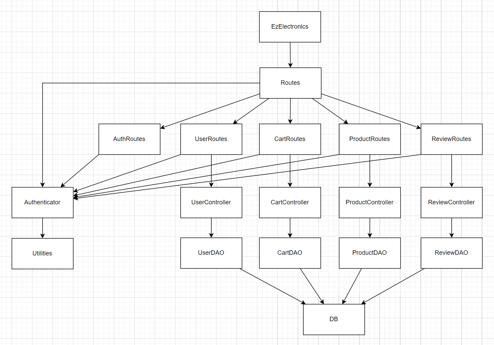
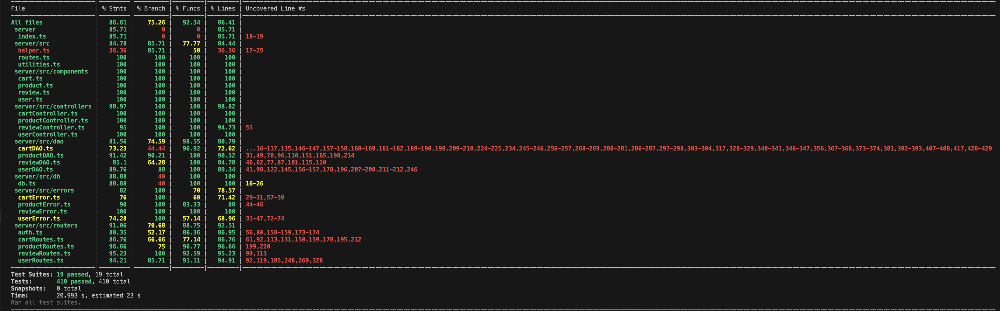
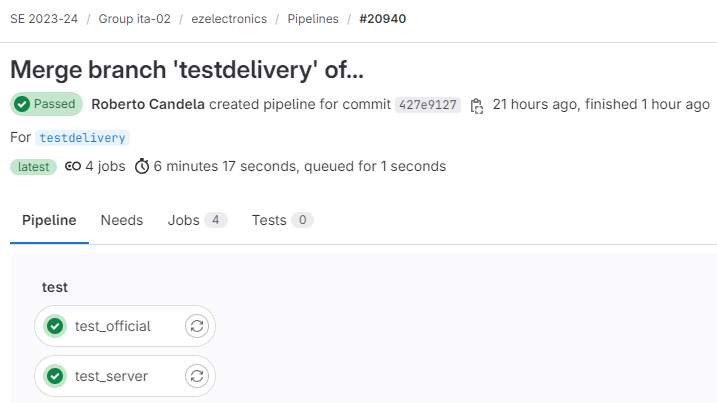

# Test Report

<The goal of this document is to explain how the application was tested, detailing how the test cases were defined and what they cover>

# Contents

- [Test Report](#test-report)
- [Contents](#contents)
- [Dependency graph](#dependency-graph)
- [Integration approach](#integration-approach)
- [Tests](#tests)
- [Coverage](#coverage)
  - [Coverage of FR](#coverage-of-fr)
  - [Coverage white box](#coverage-white-box)

# Dependency graph

# Integration approach

    - Per quanto riguarda i test della classe Product, è stato utilizzato l'approccio Bottom Up

    Step 1: ProductDAO
    Step 2: ProductController
    Step 3: ProductRoute
    Step 4: ProductDAO + ProductController + ProductRoute (API)

    - Per quanto riguarda i test della classe User, è stato utilizzato l'approccio Bottom Up

    Step 1: UserRoute
    Step 2: UserController
    Step 3: UserDAO
    Step 4: UserDAO + UserController + UserRoute (API)

    - Per quanto riguarda i test della classe Cart, è stato utilizzato l'approccio Bottom Up

    Step 1: Unit tests CartDAO
    Step 2: Integration tests CartDAO
    Step 3: Unit tests CartRoutes
    Step 4: Integration test CartRoutes

    - Per quanto riguarda i test della classe Review, è stato utilizzato l'approccio Bottom Up

    Step 1: ReviewDAO
    Step 2: ReviewController
    Step 3: ReviewRoute
    Step 4: ReviewDAO + ReviewController + ReviewRoute (API)

    Non sono stati definiti degli unit tests e degli integration tests appositamente per il CartController perchè, a seguito delle scelte implementative, ogni metodo
    della classe CartController consiste nell'invocazione di 1 solo metodo della classe CartDAO e quindi aver testato la classe CartDAO tramite gli unit tests e gli integration tests
    è sufficiente per avere la garanzia di aver testato la classe CartController con altrettanta sistematicità.

# Tests
  
Abbiamo usato la tecnica White Box - statement coverage per i test di Controller e DAO, mentre abbiamo usato la tecnica di Black Box - boundary per i test delle Routes

| Test case name                                                                                                                          | Object(s) tested | Test level  | Techniqueused          |
| --------------------------------------------------------------------------------------------------------------------------------------- | ---------------- | ----------- | ---------------------- |
| **UserRoute_UnitTest**                                                                                                                  |
| POST request to create a user: it should return a 200 success code                                                                      | UserRoutes       | Unit        | BB/ boundary           |
| POST request to create a user: it should return a 422 error code when parameters are empty                                              | UserRoutes       | Unit        | BB/ boundary           |
| POST request to create a user: it should return a 422 error code when username, name, surname and password are not string               | UserRoutes       | Unit        | BB/ boundary           |
| GET request to get all users: it should return a 200 success code                                                                       | UserRoutes       | Unit        | BB/ boundary           |
| GET request to get all users: it should return a 401 error code when the user is not an admin                                           | UserRoutes       | Unit        | BB/ boundary           |
| GET request to get all users with a specific role: it should return a 200 success code                                                  | UserRoutes       | Unit        | BB/ boundary           |
| GET request to get all users with a specific role: it should return a 401 error code, when the user is not an admin                     | UserRoutes       | Unit        | BB/ boundary           |
| GET request to get all users with a specific role: it should return a 422 error code if it filters by an invalid role                   | UserRoutes       | Unit        | BB/ boundary           |
| GET request to get a user with a specific username: it should return a 200 success code                                                 | UserRoutes       | Unit        | BB/ boundary           |
| GET request to get a user with a specific username: it should return a 401 error code if the user is not the requested user or an admin | UserRoutes       | Unit        | BB/ boundary           |
| GET request to get all users with a specific username: it should return a 404 error code if the username is invalid (does not exist)    | UserRoutes       | Unit        | BB/ boundary           |
| DELETE request to delete a personal account: it should return a 200 success code                                                        | UserRoutes       | Unit        | BB/ boundary           |
| DELETE request to delete a personal account: it should return a 401 error code if admin tries to delete another admin                   | UserRoutes       | Unit        | BB/ boundary           |
| DELETE request to delete a personal account: it should return a 401 error code if customer tries to delete another user account         | UserRoutes       | Unit        | BB/ boundary           |
| DELETE request to delete all users: it should return a 200 success code                                                                 | UserRoutes       | Unit        | BB/ boundary           |
| DELETE request to delete all users: it should return a 401 error code when no admin                                                     | UserRoutes       | Unit        | BB/ boundary           |
| PATCH request to update personal account: it should return a 200 success code                                                           | UserRoutes       | Unit        | BB/ boundary           |
| PATCH admin request to update other admin personal account: it should return a 401 error code, User Admin Error                         | UserRoutes       | Unit        | BB/ boundary           |
| PATCH user request to update other user personal account: it should return a 401 error code, Unauthorized User Error                    | UserRoutes       | Unit        | BB/ boundary           |
| PATCH user request with invalid parameters: it should return a 422 error code                                                           | UserRoutes       | Unit        | BB/ boundary           |
| PATCH user request with invalid date format: it should return a 422 error code                                                          | UserRoutes       | Unit        | BB/ boundary           |
| PATCH user request with invalid date: it should return a 400 error code, Date Error                                                     | UserRoutes       | Unit        | BB/ boundary           |
| POST request to login: it should return a 200 success code                                                                              | AuthRoutes       | Unit        | BB/ boundary           |
| POST request to login with invalid parameters: it should return a 422 error code                                                        | AuthRoutes       | Unit        | BB/ boundary           |
| DELETE request to logout: it should return a 200 success code                                                                           | AuthRoutes       | Unit        | BB/ boundary           |
| DELETE request to logout: it should return a 503 error code                                                                             | AuthRoutes       | Unit        | BB/ boundary           |
| GET request to get the currently logged in user: it should return a 200 success code                                                    | AuthRoutes       | Unit        | BB/ boundary           |
| GET request to get the currently logged in user: it should return a 401 error if not logged in                                          | AuthRoutes       | Unit        | BB/ boundary           |
| **UserController_UnitTest**                                                                                                             |
| It should return true when user is created successfully                                                                                 | UserController   | Unit        | WB/ statement coverage |
| Check if the user already exists                                                                                                        | UserController   | Unit        | WB/ statement coverage |
| It should return all the users when the parameters are correct                                                                          | UserController   | Unit        | WB/ statement coverage |
| Check if the database is empty                                                                                                          | UserController   | Unit        | WB/ statement coverage |
| It should return all the users by role when parameters are correct                                                                      | UserController   | Unit        | WB/ statement coverage |
| Check if the role does not exist                                                                                                        | UserController   | Unit        | WB/ statement coverage |
| Check if the database is empty for specific role                                                                                        | UserController   | Unit        | WB/ statement coverage |
| It should return the user by username when parameters are correct                                                                       | UserController   | Unit        | WB/ statement coverage |
| Check if the username does not exist                                                                                                    | UserController   | Unit        | WB/ statement coverage |
| It should return true when the user is deleted successfully                                                                             | UserController   | Unit        | WB/ statement coverage |
| Check if the user does not exist                                                                                                        | UserController   | Unit        | WB/ statement coverage |
| It should return true when all the users are deleted successfully                                                                       | UserController   | Unit        | WB/ statement coverage |
| It should return true when the user's info are updated successfully                                                                     | UserController   | Unit        | WB/ statement coverage |
| Check if the user does not exist during update                                                                                          | UserController   | Unit        | WB/ statement coverage |
| **UserDao_UnitTest**                                                                                                                    |
| It should return true when username and password are valid                                                                              | UserDAO          | Unit        | WB/ statement coverage |
| It should return false for non-existent username                                                                                        | UserDAO          | Unit        | WB/ statement coverage |
| It should return false for invalid password                                                                                             | UserDAO          | Unit        | WB/ statement coverage |
| It should reject with an error on database error                                                                                        | UserDAO          | Unit        | WB/ statement coverage |
| It should return true when user is created successfully                                                                                 | UserDAO          | Unit        | WB/ statement coverage |
| Check if the user already exists                                                                                                        | UserDAO          | Unit        | WB/ statement coverage |
| It should reject with an error on database error                                                                                        | UserDAO          | Unit        | WB/ statement coverage |
| It should return all the users                                                                                                          | UserDAO          | Unit        | WB/ statement coverage |
| It should reject with an error on database error                                                                                        | UserDAO          | Unit        | WB/ statement coverage |
| It should resolve with an array of users for a valid role                                                                               | UserDAO          | Unit        | WB/ statement coverage |
| It should resolve with an empty array if no users have the specified role                                                               | UserDAO          | Unit        | WB/ statement coverage |
| It should reject with an error on database error                                                                                        | UserDAO          | Unit        | WB/ statement coverage |
| It should resolve with a user object for an existing username                                                                           | UserDAO          | Unit        | WB/ statement coverage |
| It should reject with a UserNotFoundError for a non-existent username                                                                   | UserDAO          | Unit        | WB/ statement coverage |
| It should reject with an error on database error                                                                                        | UserDAO          | Unit        | WB/ statement coverage |
| It should resolve with true when user is deleted successfully                                                                           | UserDAO          | Unit        | WB/ statement coverage |
| It should reject with UserNotFoundError when user does not exist                                                                        | UserDAO          | Unit        | WB/ statement coverage |
| It should reject with UserIsAdminError when the user to delete is an admin                                                              | UserDAO          | Unit        | WB/ statement coverage |
| It should reject with an error on database error                                                                                        | UserDAO          | Unit        | WB/ statement coverage |
| It should resolve with true when all non-admin users are deleted successfully                                                           | UserDAO          | Unit        | WB/ statement coverage |
| It should reject with an error on database error                                                                                        | UserDAO          | Unit        | WB/ statement coverage |
| It should resolve with true when there are no users in the database                                                                     | UserDAO          | Unit        | WB/ statement coverage |
| It should resolve with the updated user object when the update is successful                                                            | UserDAO          | Unit        | WB/ statement coverage |
| It should reject with UserNotFoundError when the user does not exist during update                                                      | UserDAO          | Unit        | WB/ statement coverage |
| It should reject with UserNotFoundError when the user does not exist during fetch                                                       | UserDAO          | Unit        | WB/ statement coverage |
| It should reject with an error on database error during update                                                                          | UserDAO          | Unit        | WB/ statement coverage |
| It should reject with an error on database error during fetch                                                                           | UserDAO          | Unit        | WB/ statement coverage |
| **UserRoute_IntegrationTest**                                                                                                           |
| It should return a 200 success code when user is created successfully                                                                   | UserRoutes       | Integration | BB/ Boundary testing   |
| It should return a 422 error code if at least one request body parameter is empty/missing                                               | UserRoutes       | Integration | BB/ Boundary testing   |
| It should return a 422 error code if at least one request body parameter is not a string                                                | UserRoutes       | Integration | BB/ Boundary testing   |
| It should return a 422 error code if at least one request body parameter is null                                                        | UserRoutes       | Integration | BB/ Boundary testing   |
| It should return a 409 error code if the user already exists                                                                            | UserRoutes       | Integration | BB/ Boundary testing   |
| It should return an array of users when user is an admin                                                                                | UserRoutes       | Integration | BB/ Boundary testing   |
| It should return a 401 error code if the user is not an admin                                                                           | UserRoutes       | Integration | BB/ Boundary testing   |
| It should return an array of users with a specific role                                                                                 | UserRoutes       | Integration | BB/ Boundary testing   |
| It should return a 422 error code if the role is not valid                                                                              | UserRoutes       | Integration | BB/ Boundary testing   |
| It should return a 401 error code if the user is not an admin                                                                           | UserRoutes       | Integration | BB/ Boundary testing   |
| It should return a 422 error code if the role is null                                                                                   | UserRoutes       | Integration | BB/ Boundary testing   |
| It should return a user with a specific username                                                                                        | UserRoutes       | Integration | BB/ Boundary testing   |
| It should return a 404 error code if the user does not exist                                                                            | UserRoutes       | Integration | BB/ Boundary testing   |
| It should return a 401 error code if the user is not an admin or if it is not their profile                                             | UserRoutes       | Integration | BB/ Boundary testing   |
| It should return a 422 error code if username is null                                                                                   | UserRoutes       | Integration | BB/ Boundary testing   |
| It should return a 422 error code if username is not a string                                                                           | UserRoutes       | Integration | BB/ Boundary testing   |
| It should return a 200 success code when user's info are updated successfully by an admin                                               | UserRoutes       | Integration | BB/ Boundary testing   |
| It should return a 200 success code when user's info are updated successfully by themself                                               | UserRoutes       | Integration | BB/ Boundary testing   |
| It should return a 422 error code when parameters are empty                                                                             | UserRoutes       | Integration | BB/ Boundary testing   |
| It should return a 422 error code when parameters are not strings                                                                       | UserRoutes       | Integration | BB/ Boundary testing   |
| It should return a 422 error code when date format is invalid                                                                           | UserRoutes       | Integration | BB/ Boundary testing   |
| It should return a 400 error code when birthdate is wrong (after current date)                                                          | UserRoutes       | Integration | BB/ Boundary testing   |
| It should return a 401 error code when an admin tries to update another admin's info                                                    | UserRoutes       | Integration | BB/ Boundary testing   |
| It should return a 200 success code when a user is deleted successfully by an admin                                                     | UserRoutes       | Integration | BB/ Boundary testing   |
| It should return a 200 success code when a user is deleted successfully by themselves                                                   | UserRoutes       | Integration | BB/ Boundary testing   |
| It should return a 401 error code when an admin tries to delete another admin                                                           | UserRoutes       | Integration | BB/ Boundary testing   |
| It should return a 401 error code when a user tries to delete another user                                                              | UserRoutes       | Integration | BB/ Boundary testing   |
| It should return a 404 error code if the user to delete does not exist                                                                  | UserRoutes       | Integration | BB/ Boundary testing   |
| It should return a 401 error code when a customer or a manager tries to delete all users                                                | UserRoutes       | Integration | BB/ Boundary testing   |
| It should return a 200 success code when all users are deleted successfully                                                             | UserRoutes       | Integration | BB/ Boundary testing   |
| It should return a 200 success code when login is successful                                                                            | AuthRoutes       | Integration | BB/ Boundary testing   |
| It should return a 422 error code when username or password are empty                                                                   | AuthRoutes       | Integration | BB/ Boundary testing   |
| It should return a 422 error code when username or password are not string                                                              | AuthRoutes       | Integration | BB/ Boundary testing   |
| It should return a 200 success code when logout is successful                                                                           | AuthRoutes       | Integration | BB/ Boundary testing   |
| It should return a 200 success code when retrieving the current user's info is successful.                                              | AuthRoutes       | Integration | BB/ Boundary testing   |
| It should return a 401 error code when cookie is invalid.                                                                               | AuthRoutes       | Integration | BB/ Boundary testing   |
| It should return a 401 error code when there is no cookie                                                                               | AuthRoutes       | Integration | BB/ Boundary testing   |

  
| Test case name                                                      | Object(s) tested  | Test level  | Technique used         |
| ------------------------------------------------------------------- | ----------------- | ----------- | ---------------------- |
| **Unit Test - Product Controller**                                  |
| Insert new product                                                  | ProductController | Unit        | WB/ statement coverage |
| Insert new product - no date                                        | ProductController | Unit        | WB/ statement coverage |
| Insert existing product                                             | ProductController | Unit        | WB/ statement coverage |
| Insert new product - arrival date after current date                | ProductController | Unit        | WB/ statement coverage |
| Increase quantity of existing product                               | ProductController | Unit        | WB/ statement coverage |
| Increase quantity of existing product - no date                     | ProductController | Unit        | WB/ statement coverage |
| Increase quantity of non existing product                           | ProductController | Unit        | WB/ statement coverage |
| Increase quantity - changeDate before arrivalDate                   | ProductController | Unit        | WB/ statement coverage |
| Increase quantity - changeDate after current date                   | ProductController | Unit        | WB/ statement coverage |
| Record sell of existing product                                     | ProductController | Unit        | WB/ statement coverage |
| Record sell of existing product - no sellingDate                    | ProductController | Unit        | WB/ statement coverage |
| Record sell of non existing product                                 | ProductController | Unit        | WB/ statement coverage |
| Record Sell - sellingDate before arrivalDate                        | ProductController | Unit        | WB/ statement coverage |
| Record Sell - sellingDate after current date                        | ProductController | Unit        | WB/ statement coverage |
| Record sell of existing product - quantity = 0                      | ProductController | Unit        | WB/ statement coverage |
| Record sell of existing product - not enough quantity               | ProductController | Unit        | WB/ statement coverage |
| Record sell of existing product - available quantity is just enough | ProductController | Unit        | WB/ statement coverage |
| Get all products                                                    | ProductController | Unit        | WB/ statement coverage |
| Get all products - empty DB                                         | ProductController | Unit        | WB/ statement coverage |
| Get products - filter by model                                      | ProductController | Unit        | WB/ statement coverage |
| Get products - filter by not existing model                         | ProductController | Unit        | WB/ statement coverage |
| Get products - filter by null model                                 | ProductController | Unit        | WB/ statement coverage |
| Get products - filter by model and category                         | ProductController | Unit        | WB/ statement coverage |
| Get products - filter by model and category 2                       | ProductController | Unit        | WB/ statement coverage |
| Get products - filter by category                                   | ProductController | Unit        | WB/ statement coverage |
| Get products - filter by null category                              | ProductController | Unit        | WB/ statement coverage |
| Get products - filter by category - no products                     | ProductController | Unit        | WB/ statement coverage |
| Get available products                                              | ProductController | Unit        | WB/ statement coverage |
| Delete Product                                                      | ProductController | Unit        | WB/ statement coverage |
| Delete product - not existing model                                 | ProductController | Unit        | WB/ statement coverage |
| Delete all products                                                 | ProductController | Unit        | WB/ statement coverage |
| **Unit Test - Product DAO**                                         |
| Insert new product                                                  | ProductDAO        | Unit        | WB/ statement coverage |
| Insert new product - product already existing                       | ProductDAO        | Unit        | WB/ statement coverage |
| Increase quantity of existing product                               | ProductDAO        | Unit        | WB/ statement coverage |
| Increase quantity of non existing product                           | ProductDAO        | Unit        | WB/ statement coverage |
| Record sell of existing product                                     | ProductDAO        | Unit        | WB/ statement coverage |
| Record sell of non existing product                                 | ProductDAO        | Unit        | WB/ statement coverage |
| Record sell of existing product - available quantity is just enough | ProductDAO        | Unit        | WB/ statement coverage |
| Get product                                                         | ProductDAO        | Unit        | WB/ statement coverage |
| Get product - not existing model                                    | ProductDAO        | Unit        | WB/ statement coverage |
| Get all products                                                    | ProductDAO        | Unit        | WB/ statement coverage |
| Get all products - empty DB                                         | ProductDAO        | Unit        | WB/ statement coverage |
| Get products - filter by model                                      | ProductDAO        | Unit        | WB/ statement coverage |
| Get products - filter by category                                   | ProductDAO        | Unit        | WB/ statement coverage |
| Get products - filter by category - no products                     | ProductDAO        | Unit        | WB/ statement coverage |
| Get products - filter by not existing model                         | ProductDAO        | Unit        | WB/ statement coverage |
| Get products - filter by null model                                 | ProductDAO        | Unit        | WB/ statement coverage |
| Get products - filter by model and category                         | ProductDAO        | Unit        | WB/ statement coverage |
| Get products - filter by null category                              | ProductDAO        | Unit        | WB/ statement coverage |
| Get available products                                              | ProductDAO        | Unit        | WB/ statement coverage |
| Get available products - empty DB                                   | ProductDAO        | Unit        | WB/ statement coverage |
| Get products - filter by model                                      | ProductDAO        | Unit        | WB/ statement coverage |
| Get available products - filter by category                         | ProductDAO        | Unit        | WB/ statement coverage |
| Get available products - filter by category - no products           | ProductDAO        | Unit        | WB/ statement coverage |
| Get available products - filter by not existing model               | ProductDAO        | Unit        | WB/ statement coverage |
| Get available products - filter by null model                       | ProductDAO        | Unit        | WB/ statement coverage |
| Get available products - filter by model and category               | ProductDAO        | Unit        | WB/ statement coverage |
| Get available products - filter by null category                    | ProductDAO        | Unit        | WB/ statement coverage |
| Delete a product                                                    | ProductDAO        | Unit        | WB/ statement coverage |
| Delete a product - not existing model                               | ProductDAO        | Unit        | WB/ statement coverage |
| Delete all products                                                 | ProductDAO        | Unit        | WB/ statement coverage |
| Delete all products - empty DB                                      | ProductDAO        | Unit        | WB/ statement coverage |
| **Unit Test - Product Routes**                                      |
| Insert new product                                                  | ProductRoutes     | Unit        | BB/ boundary           |
| Insert new product - null model                                     | ProductRoutes     | Unit        | BB/ boundary           |
| Insert new product - no details                                     | ProductRoutes     | Unit        | BB/ boundary           |
| Insert new product - empty model                                    | ProductRoutes     | Unit        | BB/ boundary           |
| Insert new product - no category                                    | ProductRoutes     | Unit        | BB/ boundary           |
| Insert new product - wrong category                                 | ProductRoutes     | Unit        | BB/ boundary           |
| Insert new product - negative quantity                              | ProductRoutes     | Unit        | BB/ boundary           |
| Insert new product - quantity = 0                                   | ProductRoutes     | Unit        | BB/ boundary           |
| Insert new product - price = 0                                      | ProductRoutes     | Unit        | BB/ boundary           |
| Insert new product - negative price                                 | ProductRoutes     | Unit        | BB/ boundary           |
| Insert new product - price is a string                              | ProductRoutes     | Unit        | BB/ boundary           |
| Insert new product - wrong date format                              | ProductRoutes     | Unit        | BB/ boundary           |
| Insert new product - user not admin or manager                      | ProductRoutes     | Unit        | BB/ boundary           |
| Increase Product quantity                                           | ProductRoutes     | Unit        | BB/ boundary           |
| Increase Product quantity - undefined changeDate                    | ProductRoutes     | Unit        | BB/ boundary           |
| Increase Product quantity - quantity = 0                            | ProductRoutes     | Unit        | BB/ boundary           |
| Increase Product quantity - negative quantity                       | ProductRoutes     | Unit        | BB/ boundary           |
| Increase Product quantity - wrong changeDate format                 | ProductRoutes     | Unit        | BB/ boundary           |
| Increase Product quantity - user not admin or manager               | ProductRoutes     | Unit        | BB/ boundary           |
| Sell Product                                                        | ProductRoutes     | Unit        | BB/ boundary           |
| Sell Product - quantity = 0                                         | ProductRoutes     | Unit        | BB/ boundary           |
| Sell Product - negative quantity                                    | ProductRoutes     | Unit        | BB/ boundary           |
| Sell Product - wrong sellingDate format                             | ProductRoutes     | Unit        | BB/ boundary           |
| Sell Product - undefined sellingDate                                | ProductRoutes     | Unit        | BB/ boundary           |
| Sell Product - user not admin or manager                            | ProductRoutes     | Unit        | BB/ boundary           |
| Retrieve all Products                                               | ProductRoutes     | Unit        | BB/ boundary           |
| Retrieve all Products - filter by model                             | ProductRoutes     | Unit        | BB/ boundary           |
| Retrieve all Products - filter by category                          | ProductRoutes     | Unit        | BB/ boundary           |
| Retrieve all Products - user not logged in                          | ProductRoutes     | Unit        | BB/ boundary           |
| Retrieve available Products                                         | ProductRoutes     | Unit        | BB/ boundary           |
| Retrieve available Products - filter by model                       | ProductRoutes     | Unit        | BB/ boundary           |
| Retrieve available Products - filter by category                    | ProductRoutes     | Unit        | BB/ boundary           |
| Retrieve available Products - user not logged in                    | ProductRoutes     | Unit        | BB/ boundary           |
| Delete all Products                                                 | ProductRoutes     | Unit        | BB/ boundary           |
| Delete all Products - user not Admin or Manager                     | ProductRoutes     | Unit        | BB/ boundary           |
| Delete Product                                                      | ProductRoutes     | Unit        | BB/ boundary           |
| Delete Product - user not Admin or Manager                          | ProductRoutes     | Unit        | BB/ boundary           |
| **Integration Test - Product Routes**                               |
| Insert new product                                                  | ProductRoutes     | Integration | BB/ boundary           |
| Insert new product - null model                                     | ProductRoutes     | Integration | BB/ boundary           |
| Insert new product - no details                                     | ProductRoutes     | Integration | BB/ boundary           |
| Insert new product - empty model                                    | ProductRoutes     | Integration | BB/ boundary           |
| Insert new product - no category                                    | ProductRoutes     | Integration | BB/ boundary           |
| Insert new product - wrong category                                 | ProductRoutes     | Integration | BB/ boundary           |
| Insert new product - negative quantity                              | ProductRoutes     | Integration | BB/ boundary           |
| Insert new product - quantity = 0                                   | ProductRoutes     | Integration | BB/ boundary           |
| Insert new product - negative price                                 | ProductRoutes     | Integration | BB/ boundary           |
| Insert new product - price = 0                                      | ProductRoutes     | Integration | BB/ boundary           |
| Insert new product - price is a string                              | ProductRoutes     | Integration | BB/ boundary           |
| Insert new product - wrong date format                              | ProductRoutes     | Integration | BB/ boundary           |
| Insert new product - user not logged in                             | ProductRoutes     | Integration | BB/ boundary           |
| Insert new product - user is customer                               | ProductRoutes     | Integration | BB/ boundary           |
| Insert existing product                                             | ProductRoutes     | Integration | BB/ boundary           |
| Insert new product - arrival date after current date                | ProductRoutes     | Integration | BB/ boundary           |
| Insert new product - no arrival date                                | ProductRoutes     | Integration | BB/ boundary           |
| Insert new product - empty arrival date                             | ProductRoutes     | Integration | BB/ boundary           |
| Increase Product Quantity                                           | ProductRoutes     | Integration | BB/ boundary           |
| Increase Product Quantity - undefined changeDate                    | ProductRoutes     | Integration | BB/ boundary           |
| Increase Product Quantity - empty changeDate                        | ProductRoutes     | Integration | BB/ boundary           |
| Increase Product Quantity - quantity = 0                            | ProductRoutes     | Integration | BB/ boundary           |
| Increase Product Quantity - negative quantity                       | ProductRoutes     | Integration | BB/ boundary           |
| Increase Product Quantity - wrong change date format                | ProductRoutes     | Integration | BB/ boundary           |
| Increase Product Quantity - change date after current date          | ProductRoutes     | Integration | BB/ boundary           |
| Increase Product Quantity - change date before arrival date         | ProductRoutes     | Integration | BB/ boundary           |
| Increase Product Quantity - non existing product                    | ProductRoutes     | Integration | BB/ boundary           |
| Increase Product Quantity - user not logged in                      | ProductRoutes     | Integration | BB/ boundary           |
| Increase Product Quantity - user is customer                        | ProductRoutes     | Integration | BB/ boundary           |
| Sell existing product                                               | ProductRoutes     | Integration | BB/ boundary           |
| Sell existing product - quantity = 0                                | ProductRoutes     | Integration | BB/ boundary           |
| Sell existing product - negative quantity                           | ProductRoutes     | Integration | BB/ boundary           |
| Sell existing product - wrong selling date format                   | ProductRoutes     | Integration | BB/ boundary           |
| Sell existing product - undefined selling date                      | ProductRoutes     | Integration | BB/ boundary           |
| Sell existing product - empty selling date                          | ProductRoutes     | Integration | BB/ boundary           |
| Sell existing product - selling date after current date             | ProductRoutes     | Integration | BB/ boundary           |
| Sell existing product - selling date before arrival date            | ProductRoutes     | Integration | BB/ boundary           |
| Sell not existing product                                           | ProductRoutes     | Integration | BB/ boundary           |
| Sell existing product - product quantity = 0                        | ProductRoutes     | Integration | BB/ boundary           |
| Sell existing product - product quantity < selling quantity         | ProductRoutes     | Integration | BB/ boundary           |
| Sell existing product - quantity is just enough                     | ProductRoutes     | Integration | BB/ boundary           |
| Sell existing product - user is customer                            | ProductRoutes     | Integration | BB/ boundary           |
| Sell existing product - user not logged in                          | ProductRoutes     | Integration | BB/ boundary           |
| Retrieve all products                                               | ProductRoutes     | Integration | BB/ boundary           |
| Retrieve all products - filter by model                             | ProductRoutes     | Integration | BB/ boundary           |
| Retrieve all products - filter by category                          | ProductRoutes     | Integration | BB/ boundary           |
| Retrieve all products - filter by not existing model                | ProductRoutes     | Integration | BB/ boundary           |
| Retrieve all products - filter by null model                        | ProductRoutes     | Integration | BB/ boundary           |
| Retrieve all products - filter by model and category                | ProductRoutes     | Integration | BB/ boundary           |
| Retrieve all products - filter by model and category 2              | ProductRoutes     | Integration | BB/ boundary           |
| Retrieve all products - filter by model and category 3              | ProductRoutes     | Integration | BB/ boundary           |
| Retrieve all products - filter by null category                     | ProductRoutes     | Integration | BB/ boundary           |
| Retrieve all products - filter by not existing category             | ProductRoutes     | Integration | BB/ boundary           |
| Retrieve all products - not null category                           | ProductRoutes     | Integration | BB/ boundary           |
| Retrieve all products - not null model                              | ProductRoutes     | Integration | BB/ boundary           |
| Retrieve all products - user is customer                            | ProductRoutes     | Integration | BB/ boundary           |
| Retrieve all products - user not logged in                          | ProductRoutes     | Integration | BB/ boundary           |
| Retrieve available products                                         | ProductRoutes     | Integration | BB/ boundary           |
| Retrieve available products - filter by model                       | ProductRoutes     | Integration | BB/ boundary           |
| Retrieve available products - filter by not available model         | ProductRoutes     | Integration | BB/ boundary           |
| Retrieve available products - filter by category                    | ProductRoutes     | Integration | BB/ boundary           |
| Retrieve available products - filter by not existing model          | ProductRoutes     | Integration | BB/ boundary           |
| Retrieve available products - filter by null model                  | ProductRoutes     | Integration | BB/ boundary           |
| Retrieve available products - filter by model and category          | ProductRoutes     | Integration | BB/ boundary           |
| Retrieve available products - filter by model and category 2        | ProductRoutes     | Integration | BB/ boundary           |
| Retrieve available products - filter by model and category 3        | ProductRoutes     | Integration | BB/ boundary           |
| Retrieve available products - filter by null category               | ProductRoutes     | Integration | BB/ boundary           |
| Retrieve available products - filter by not existing category       | ProductRoutes     | Integration | BB/ boundary           |
| Retrieve available products - not null category                     | ProductRoutes     | Integration | BB/ boundary           |
| Retrieve available products - not null model                        | ProductRoutes     | Integration | BB/ boundary           |
| Retrieve available products - user is customer                      | ProductRoutes     | Integration | BB/ boundary           |
| Retrieve available products - user not logged in                    | ProductRoutes     | Integration | BB/ boundary           |
| Delete all Products                                                 | ProductRoutes     | Integration | BB/ boundary           |
| Delete all Products - user is customer                              | ProductRoutes     | Integration | BB/ boundary           |
| Delete all Products - user not logged in                            | ProductRoutes     | Integration | BB/ boundary           |
| Delete Product                                                      | ProductRoutes     | Integration | BB/ boundary           |
| Delete Product - not existing model                                 | ProductRoutes     | Integration | BB/ boundary           |
| Delete Product - user is customer                                   | ProductRoutes     | Integration | BB/ boundary           |
| Delete Product - user not logged                                    | ProductRoutes     | Integration | BB/ boundary           |

| Test case name                                                                                                                            | Object(s) tested | Test level  | Technique used         |
| ----------------------------------------------------------------------------------------------------------------------------------------- | ---------------- | ----------- | ---------------------- |
| **Unit Tests - CartDAO**                                                                                                                  |
| Add a product instance                                                                                                                    | CartDAO          | Unit        | WB/ statement coverage |
| Add a product instance - there is already at least one instance of the product in the cart                                                | CartDAO          | Unit        | WB/ statement coverage |
| Add a product instance - there is no information about the current unpaid cart of the user                                                | CartDAO          | Unit        | WB/ statement coverage |
| Add a product instance - model does not represent an existing product                                                                     | CartDAO          | Unit        | WB/ statement coverage |
| Add a product instance - model represents a product whose available quantity is 0                                                         | CartDAO          | Unit        | WB/ statement coverage |
| Get current cart of the logged in user                                                                                                    | CartDAO          | Unit        | WB/ statement coverage |
| Get current cart of the logged in user - there is no information about an unpaid cart                                                     | CartDAO          | Unit        | WB/ statement coverage |
| Payment for the current cart of the logged in user                                                                                        | CartDAO          | Unit        | WB/ statement coverage |
| Payment for the current cart of the logged in user - there is no information about an unpaid cart in the database                         | CartDAO          | Unit        | WB/ statement coverage |
| Payment for the current cart of the logged in user - there is information about an unpaid cart but the cart contains no product           | CartDAO          | Unit        | WB/ statement coverage |
| Payment for the current cart of the logged in user - there is at least one product in the cart whose available quantity in the stock is 0 | CartDAO          | Unit        | WB/ statement coverage |
| Get the history of the carts that have been paid for by the current user                                                                  | CartDAO          | Unit        | WB/ statement coverage |
| Get the history of the carts that have been paid for by the current user - the user has no carts                                          | CartDAO          | Unit        | WB/ statement coverage |
| Delete an instance of a product from the current cart of the logged in user - quantity is equal to 1                                      | CartDAO          | Unit        | WB/ statement coverage |
| Delete an instance of a product from the current cart of the logged in user - quantity is greater than 1                                  | CartDAO          | Unit        | WB/ statement coverage |
| Delete an instance of a product from the current cart of the logged in user - model represents a product that is not in the cart          | CartDAO          | Unit        | WB/ statement coverage |
| Delete an instance of a product from the current cart of the logged in user - there is no information about an unpaid cart for the user   | CartDAO          | Unit        | WB/ statement coverage |
| Delete an instance of a product from the current cart of the logged in user - model does not represent an existing product                | CartDAO          | Unit        | WB/ statement coverage |
| Delete the current cart                                                                                                                   | CartDAO          | Unit        | WB/ statement coverage |
| Delete the current cart - there is no information about an unpaid cart for the user                                                       | CartDAO          | Unit        | WB/ statement coverage |
| Delete all existing carts of all users                                                                                                    | CartDAO          | Unit        | WB/ statement coverage |
| Get all carts of all users                                                                                                                | CartDAO          | Unit        | WB/ statement coverage |
| Get products in cart                                                                                                                      | CartDAO          | Unit        | WB/ statement coverage |
| Get products in cart - empty cart                                                                                                         | CartDAO          | Unit        | WB/ statement coverage |
| **Integration Tests - CartDAO**                                                                                                           |
| Get current cart of the logged in user                                                                                                    | CartDAO          | Integration | BB/ boundary           |
| Get current cart of the logged in user - there is no information about an unpaid cart                                                     | CartDAO          | Integration | BB/ boundary           |
| Get current cart of the logged in user - there is an unpaid cart with no products                                                         | CartDAO          | Integration | BB/ boundary           |
| Add a product instance                                                                                                                    | CartDAO          | Integration | BB/ boundary           |
| Add a product instance - there is already at least one instance of the product in the cart                                                | CartDAO          | Integration | BB/ boundary           |
| Add a product instance - there is no information about the current unpaid cart of the user                                                | CartDAO          | Integration | BB/ boundary           |
| Add a product instance - model does not represent an existing product                                                                     | CartDAO          | Integration | BB/ boundary           |
| Add a product instance - model represents a product whose available quantity is 0                                                         | CartDAO          | Integration | BB/ boundary           |
| Payment for the current cart of the logged in user                                                                                        | CartDAO          | Integration | BB/ boundary           |
| Payment for the current cart of the logged in user - there is no information about an unpaid cart in the database                         | CartDAO          | Integration | BB/ boundary           |
| Payment for the current cart of the logged in user - there is information about an unpaid cart but the cart contains no product           | CartDAO          | Integration | BB/ boundary           |
| Payment for the current cart of the logged in user - there is at least one product in the cart whose available quantity in the stock is 0 | CartDAO          | Integration | BB/ boundary           |
| Get the history of the carts that have been paid for by the current user                                                                  | CartDAO          | Integration | BB/ boundary           |
| Get the history of the carts that have been paid for by the current user - the user has no carts                                          | CartDAO          | Integration | BB/ boundary           |
| Delete an instance of a product from the current cart of the logged in user - quantity is equal to 1                                      | CartDAO          | Integration | BB/ boundary           |
| Delete an instance of a product from the current cart of the logged in user - quantity is greater than 1                                  | CartDAO          | Integration | BB/ boundary           |
| Delete an instance of a product from the current cart of the logged in user - model represents a product that is not in the cart          | CartDAO          | Integration | BB/ boundary           |
| Delete an instance of a product from the current cart of the logged in user - there is no information about an unpaid cart for the user   | CartDAO          | Integration | BB/ boundary           |
| Delete an instance of a product from the current cart of the logged in user - there are no products in the cart                           | CartDAO          | Integration | BB/ boundary           |
| Delete an instance of a product from the current cart of the logged in user - model does not represent an existing product                | CartDAO          | Integration | BB/ boundary           |
| Delete the current cart                                                                                                                   | CartDAO          | Integration | BB/ boundary           |
| Delete the current cart - there is no information about an unpaid cart for the user                                                       | CartDAO          | Integration | BB/ boundary           |
| Get all carts of all users                                                                                                                | CartDAO          | Integration | BB/ boundary           |
| Delete all existing carts of all users                                                                                                    | CartDAO          | Integration | BB/ boundary           |
| **Unit Tests - CartRoutes**                                                                                                               |
| GET / - Get current cart of the logged in user                                                                                            | CartRoutes       | Unit        | WB/ statement coverage |
| GET / - The user is not logged in as a Customer                                                                                           | CartRoutes       | Unit        | WB/ statement coverage |
| POST / - Add a product instance                                                                                                           | CartRoutes       | Unit        | WB/ statement coverage |
| POST / - The user is not logged in as a Customer                                                                                          | CartRoutes       | Unit        | WB/ statement coverage |
| POST / - model is an empty string                                                                                                         | CartRoutes       | Unit        | WB/ statement coverage |
| PATCH / - Payment for the current cart of the logged in user                                                                              | CartRoutes       | Unit        | WB/ statement coverage |
| PATCH / - The user is not logged in as a Customer                                                                                         | CartRoutes       | Unit        | WB/ statement coverage |
| GET /history - Get the history of the carts that have been paid for by the current user                                                   | CartRoutes       | Unit        | WB/ statement coverage |
| GET /history - The user is not logged in as a Customer                                                                                    | CartRoutes       | Unit        | WB/ statement coverage |
| DELETE /products/:model - Delete an instance of a product from the current cart of the logged in user                                     | CartRoutes       | Unit        | WB/ statement coverage |
| DELETE /products/:model - The user is not logged in as a Customer                                                                         | CartRoutes       | Unit        | WB/ statement coverage |
| DELETE /current - Delete the current cart                                                                                                 | CartRoutes       | Unit        | WB/ statement coverage |
| DELETE /current - The user is not logged in as a Customer                                                                                 | CartRoutes       | Unit        | WB/ statement coverage |
| DELETE / - Delete all existing carts of all users                                                                                         | CartRoutes       | Unit        | WB/ statement coverage |
| DELETE / - The user is logged in as neither an Admin nor a Manager                                                                        | CartRoutes       | Unit        | WB/ statement coverage |
| GET /all - Get all carts of all users                                                                                                     | CartRoutes       | Unit        | WB/ statement coverage |
| GET /all - The user is logged in as neither an Admin nor a Manager                                                                        | CartRoutes       | Unit        | WB/ statement coverage |
| **Integration Tests - CartRoutes**                                                                                                        |
| GET / - Get current cart of the logged in user                                                                                            | CartRoutes       | Integration | BB/ boundary           |
| GET / - Get current cart of the logged in user - there is no information about an unpaid cart                                             | CartRoutes       | Integration | BB/ boundary           |
| GET / - It should return a 401 error code                                                                                                 | CartRoutes       | Integration | BB/ boundary           |
| POST / - Add a product instance                                                                                                           | CartRoutes       | Integration | BB/ boundary           |
| POST / - It should return a 401 error code                                                                                                | CartRoutes       | Integration | BB/ boundary           |
| POST / - model is an empty string                                                                                                         | CartRoutes       | Integration | BB/ boundary           |
| PATCH / - Payment for the current cart of the logged in user                                                                              | CartRoutes       | Integration | BB/ boundary           |
| PATCH / - It should return a 401 error code                                                                                               | CartRoutes       | Integration | BB/ boundary           |
| GET /history - Get the history of the carts that have been paid for by the current user                                                   | CartRoutes       | Integration | BB/ boundary           |
| GET /history - It should return a 401 error code                                                                                          | CartRoutes       | Integration | BB/ boundary           |
| DELETE /products/:model - Delete an instance of a product from the current cart of the logged in user                                     | CartRoutes       | Integration | BB/ boundary           |
| DELETE /products/:model - It should return a 401 error code                                                                               | CartRoutes       | Integration | BB/ boundary           |
| DELETE /products/:model - model is an empty string                                                                                        | CartRoutes       | Integration | BB/ boundary           |
| DELETE /current - Delete the current cart                                                                                                 | CartRoutes       | Integration | BB/ boundary           |
| DELETE /current - It should return a 401 error code                                                                                       | CartRoutes       | Integration | BB/ boundary           |
| GET /all - Get all carts of all users                                                                                                     | CartRoutes       | Integration | BB/ boundary           |
| GET /all - It should return a 401 error code                                                                                              | CartRoutes       | Integration | BB/ boundary           |
| DELETE / - Delete all existing carts of all users                                                                                         | CartRoutes       | Integration | BB/ boundary           |
| DELETE / - It should return a 401 error code                                                                                              | CartRoutes       | Integration | BB/ boundary           |

| Test case name                                                                        | Object(s) tested                            | Test level  | Technique used         |
| ------------------------------------------------------------------------------------- | ------------------------------------------- | ----------- | ---------------------- |
| **Review Unit Tests - Controller**                                                    |                                             |             |                        |
| Add a new review                                                                      | ReviewController                            | Unit        | WB/ statement coverage |
| Get all reviews for a product                                                         | ReviewController                            | Unit        | WB/ statement coverage |
| Delete a review                                                                       | ReviewController                            | Unit        | WB/ statement coverage |
| Delete all reviews for a product                                                      | ReviewController                            | Unit        | WB/ statement coverage |
| Delete all reviews                                                                    | ReviewController                            | Unit        | WB/ statement coverage |
| **Review Unit Tests - DAO**                                                           |                                             |             |                        |
| Insert new product review                                                             | ProductReviewDAO                            | Unit        | WB/ statement coverage |
| Insert new product review - duplicate                                                 | ProductReviewDAO                            | Unit        | WB/ statement coverage |
| Get product reviews by model                                                          | ProductReviewDAO                            | Unit        | WB/ statement coverage |
| Delete product review                                                                 | ProductReviewDAO                            | Unit        | WB/ statement coverage |
| Delete product review - not found                                                     | ProductReviewDAO                            | Unit        | WB/ statement coverage |
| **Review Unit Tests - Routes**                                                        |                                             |             |                        |
| POST /ezelectronics/reviews/:model                                                    | ReviewRoutes                                | Unit        | WB/ statement coverage |
| POST /ezelectronics/reviews/:model - duplicate review error                           | ReviewRoutes                                | Unit        | WB/ statement coverage |
| POST /ezelectronics/reviews/:model - invalid score error                              | ReviewRoutes                                | Unit        | WB/ statement coverage |
| GET /ezelectronics/reviews/:model                                                     | ReviewRoutes                                | Unit        | WB/ statement coverage |
| GET /ezelectronics/reviews/:model - no reviews found error                            | ReviewRoutes                                | Unit        | WB/ statement coverage |
| DELETE /ezelectronics/reviews/:model                                                  | ReviewRoutes                                | Unit        | WB/ statement coverage |
| DELETE /ezelectronics/reviews/:model - review not found error                         | ReviewRoutes                                | Unit        | WB/ statement coverage |
| DELETE /ezelectronics/reviews/:model/all                                              | ReviewRoutes                                | Unit        | WB/ statement coverage |
| DELETE /ezelectronics/reviews                                                         | ReviewRoutes                                | Unit        | WB/ statement coverage |
| **Review Integration Tests - DAO**                                                    |                                             |             |                        |
| addReview - should add a new review                                                   | ReviewDAO, Database (mocked), Sample data   | Integration | BB/ boundary           |
| addReview - should reject adding duplicate review                                     | ReviewDAO, Database (mocked), Sample data   | Integration | BB/ boundary           |
| addReview - should reject adding review for non-existing product                      | ReviewDAO, Database (mocked), Sample data   | Integration | BB/ boundary           |
| getProductReviews - should get reviews for a product                                  | ReviewDAO, Database (mocked), Sample data   | Integration | BB/ boundary           |
| getProductReviews - should return empty array for non-existing product                | ReviewDAO, Database (mocked), Sample data   | Integration | BB/ boundary           |
| deleteReview - should delete a review                                                 | ReviewDAO, Database (mocked), Sample data   | Integration | BB/ boundary           |
| deleteReview - should reject deleting non-existing review not existing model and user | ReviewDAO, Database (mocked), Sample data   | Integration | BB/ boundary           |
| deleteReview - should reject deleting non-existing review not existing user           | ReviewDAO, Database (mocked), Sample data   | Integration | BB/ boundary           |
| deleteReview - should reject deleting non-existing review not existing model          | ReviewDAO, Database (mocked), Sample data   | Integration | BB/ boundary           |
| deleteReviewsOfProduct - should delete all reviews of a product                       | ReviewDAO, Database (mocked), Sample data   | Integration | BB/ boundary           |
| deleteAllReviews - should delete all reviews                                          | ReviewDAO, Database (mocked), Sample data   | Integration | BB/ boundary           |
| **Review Integration Tests - Routes**                                                 |                                             |             |                        |
| Insert review - Insert new review                                                     | Express app, Database (mocked), Sample data | Integration | BB/ boundary           |
| Get a review - Get a review                                                           | Express app, Database (mocked), Sample data | Integration | BB/ boundary           |
| Delete a review - Delete a review                                                     | Express app, Database (mocked), Sample data | Integration | BB/ boundary           |
| Delete all reviews for a product - Admin                                              | Express app, Database (mocked), Sample data | Integration | BB/ boundary           |
| Delete all reviews for a product - Manager                                            | Express app, Database (mocked), Sample data | Integration | BB/ boundary           |
| Delete all reviews for a product - Customer (Unauthorized)                            | Express app, Database (mocked), Sample data | Integration | BB/ boundary           |
| Delete all reviews - Admin                                                            | Express app, Database (mocked), Sample data | Integration | BB/ boundary           |
| Delete all reviews - Manager                                                          | Express app, Database (mocked), Sample data | Integration | BB/ boundary           |
| Delete all reviews - Customer (Unauthorized)                                          | Express app, Database (mocked), Sample data | Integration | BB/ boundary           |

# Coverage

## Coverage of FR

| Functional Requirement or scenario | Test(s)                                                                                                                                                                            |
| ---------------------------------- | ---------------------------------------------------------------------------------------------------------------------------------------------------------------------------------- |
| **FR1**                            |                                                                                                                                                                                    |
| FR1.1                              | POST request to login                                                                                                                                                              |
| FR1.2                              | DELETE request to logout                                                                                                                                                           |
| FR1.3                              | POST request to create a user                                                                                                                                                      |
| **FR2**                            |                                                                                                                                                                                    |
| FR2.1                              | GET request to get all users                                                                                                                                                       |
| FR2.2                              | GET request to get all users with a specific role                                                                                                                                  |
| FR2.3                              | GET request to get a user with a specific username                                                                                                                                 |
| FR2.4                              | PATCH request to update personal account                                                                                                                                           |
| FR2.5                              | DELETE request to delete a personal account                                                                                                                                        |
| FR2.6                              | DELETE request to delete all users                                                                                                                                                 |
| **FR3**                            |                                                                                                                                                                                    |
| FR3.1                              | Insert new product, Insert existing product                                                                                                                                        |
| FR3.2                              | Increase quantity                                                                                                                                                                  |
| FR3.3                              | Record sell of existing product, Record sell of non existing product                                                                                                               |
| FR3.4                              | Get all products                                                                                                                                                                   |
| FR3.4.1                            | Get available products                                                                                                                                                             |
| FR3.5                              | Get products - filter by category                                                                                                                                                  |
| FR3.5.1                            | Get available products - filter by category                                                                                                                                        |
| FR3.6                              | Get products - filter by model                                                                                                                                                     |
| FR3.6.1                            | Get available products - filter by model                                                                                                                                           |
| FR3.7                              | Delete Product                                                                                                                                                                     |
| FR3.8                              | Delete all Products                                                                                                                                                                |
| **FR4**                            |                                                                                                                                                                                    |
| FR4.1                              | Adding a new review for a product, check for product, user existence and logged user                                                                                               |
| FR4.2                              | Get the list of product's review, check for product existence and logged user                                                                                                      |
| FR4.3                              | Delete a specific review for a product, check user ownership,product existence and logged user                                                                                     |
| FR4.4                              | Delete all reviews for a product, check product existence, check user permission                                                                                                   |
| FR4.5                              | Delete all reviews for all product, check user permission                                                                                                                          |
| **FR5**                            |                                                                                                                                                                                    |
| FR5.1                              | Get current cart of the logged in user, GET / - Get current cart of the logged in user                                                                                             |
| FR5.2                              | Add a product instance, POST / - Add a product instance                                                                                                                            |
| FR5.3                              | Payment for the current cart of the logged in user, PATCH / - Payment for the current cart of the logged in user                                                                   |
| FR5.4                              | Get the history of the carts that have been paid for by the current user, GET /history - Get the history of the carts that have been paid for by the current user                  |
| FR5.5                              | Delete an instance of a product from the current cart of the logged in user, DELETE /products/:model - Delete an instance of a product from the current cart of the logged in user |
| FR5.6                              | Delete the current cart, DELETE /current - Delete the current cart                                                                                                                 |
| FR5.7                              | Get all carts of all users, GET /all - Get all carts of all users                                                                                                                  |
| FR5.8                              | Delete all existing carts of all users, DELETE / - Delete all existing carts of all users                                                                                          |

## Coverage white box

Report here the screenshot of coverage values obtained with jest-- coverage

Le percentuali dei branch coperti di cartDAO.ts e cartRoutes.ts non raggiungono i valori delle corrispondenti percentuali degli altri file testati perchè,
per via delle scelte implementative, sono stati inseriti dei blocchi catch di controllo che non vengono mai acceduti se non nei rari casi in cui err assume un valore truthy, 
come ad es quello in cui ci sono dei problemi di connessione al db.

In conclusione, riportiamo uno screenshot del report di superamento dei tests eseguiti dalla pipeline #20940 di GitLab eseguito nella giornata del 16/06/2024
per verificare che la percentuale di tests passati in locale corrispondesse alla percentuale di tests passati in remoto:

