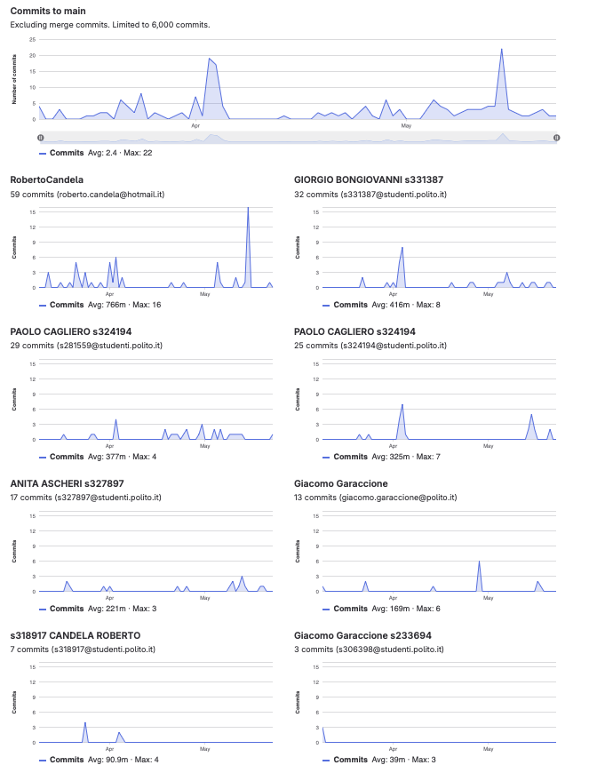

# Gruppo 2

## Valutazione deliverable V1

| gruppo | context diagram | business model | stakeholder | stories | interface | FR | NFR | use cases diagram | use cases | scenario | Glossary | DeploymentDiagram | functionality | estimation doc | precisione valori estimation | valutazione |
| --- | --- | --- | --- | --- | --- | --- | --- | --- | --- | --- | --- | --- | --- | --- | --- | --- |
| - | 1 | 0.5 | 0.5 | 1 | 1 | 3 | 3 | 1 | 5 | 5 | 5 | 2 | 1 | 2 | 2 | 33 |
| 2 | 95 | 100 | 100 | 90 | 95 | 100 | 95 | 100 | 100 | 100 | 95 | 100 | 100 | 90 | 66.87 | 97.1 |

## Valutazione deliverable V2

| gruppo | context diagram | business model | stakeholder | stories | interface | FR | NFR | ACCESS RIGHTS | use cases diagram | use cases | scenario | Glossary | DeploymentDiagram | functionality | estimation | precisione valori estimation | valutazione |
| --- | --- | --- | --- | --- | --- | --- | --- | --- | --- | --- | --- | --- | --- | --- | --- | --- | --- |
| - | 1 | 0.5 | 0.5 | 1 | 1 | 3 | 2 | 1 | 1 | 5 | 5 | 5 | 2 | 1 | 2 | 2 | 33 |
| 2 | 100 | 100 | 100 | 100 | 100 | 100 | 100 | 0 | 100 | 100 | 100 | 100 | 100 | 100 | 95 | 89.65 | 97.57 |

Le percentuali di v2 sono state riscalate in quanto la media pesata delle percentuali portava alcuni gruppi oltre al 100%.

## Valutazione codice e test (V2 + V3)

| Test Unit Totali | Test Unit Passati | Statement Coverage Unit | Branch Coverage Unit | Function Coverage Unit | Line Coverage Unit | Test Integration Totali | Test Integration Falliti | Statement Coverage Integration | Branch Coverage Integration | Function Coverage Integration | Line Coverage Integration | Correttezza V2 | Correttezza V3 | valutazione |
| --- | --- | --- | --- | --- | --- | --- | --- | --- | --- | --- | --- | --- | --- | --- |
| 1 | 0.5 | 2 | 2 | 1 | 1 | 1 | 0.5 | 2 | 2 | 1 | 1 | 16 | 2 | 33 |
| 75 | 100 | 100 | 75 | 100 | 100 | 100 | 100 | 100 | 75 | 100 | 100 | 84.8739495798319 | 100 | 88.88 |

 Unit e integration test prodotti dai gruppi sono stati eseguiti con la versione V2 del codice.

## Risultati Progetto

| Deliverable | Punteggio | Peso |
| --- | --- | --- |
| **Documenti V1** | 97.1% | 6 |
| **Documenti V2** | 96.26% | 2 |
| **Codice e Test** | 88.88% | 22 |
| **Timesheet** | 100.0% | 3 |
| **Valutazione** | 30.30 | 33 |
| **Valutazione** | 12.12 | 13.2 |

## Calcolo pesi progetto per singolo studente

| cognome | nome | email | gruppo | commit studente | commit totali | commit sul totale | coefficiente catme | coefficiente pesato | coefficiente progetto |
| --- | --- | --- | --- | --- | --- | --- | --- | --- | --- |
| ASCHERI | ANITA | s327897@studenti.polito.it | 2 | 17 | 169 | 0.10 | 0.90 | 0.74 | 0.82 |
| BONGIOVANNI | GIORGIO | s331387@studenti.polito.it | 2 | 32 | 169 | 0.19 | 1.05 | 0.88 | 0.97 |
| CAGLIERO | PAOLO | s324194@studenti.polito.it | 2 | 54 | 169 | 0.32 | 1.05 | 0.90 | 1.00 |
| CANDELA | ROBERTO | s318917@studenti.polito.it | 2 | 66 | 169 | 0.39 | 0.92 | 0.81 | 0.90 |

 I pesi del progetto sono ottenuti per l'80% dal valore calcolato da CATME e per il 20% dalla percentuale dei commit del singolo studente sul totale dei commit effettuati dagli studenti dello stesso gruppo. Il risultato è stato poi riscalato in modo che il punteggio più alto del gruppo ottenesse 1.

## Studenti

| Nome | Matricola | Email | Bonus | Voto Primo Appello | Voto Secondo Appello | Voto Progetto | Voto Finale |
| --- | --- | --- | --- | --- | --- | --- | --- |
| PAOLO CAGLIERO | 324194 | s324194@studenti.polito.it | 1 | 18.2 | | 12.12 | 30 |
| ANITA ASCHERI | 327897 | s327897@studenti.polito.it | 1 | 15.9 | | 9.92 | 27 |
| GIORGIO BONGIOVANNI | 331387 | s331387@studenti.polito.it | 1 |  | 16.5 | 11.77 | 29 |
| ROBERTO CANDELA | 318917 | s318917@studenti.polito.it | 0 |  | | 10.92 |  |
